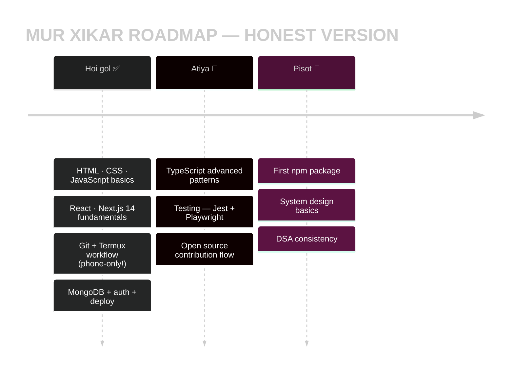
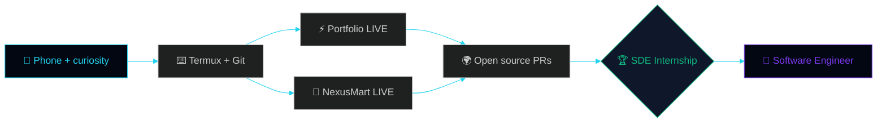

<div align="center">

<!-- ══════════════════════════════════════════════════════════════════ -->
<!--   THE LEARNING LOG · MY CODING JOURNEY — 100% FROM A PHONE 📱       -->
<!--   Custom hand-built SMIL hero banner (dark+light) · 167-animation   -->
<!--   spec applied · honest learning-in-public edition · one of one     -->
<!-- ══════════════════════════════════════════════════════════════════ -->

<!-- ═══ CUSTOM PREMIUM HERO — MY OWN SVG, theme-aware (rarest element possible) ═══ -->
<picture>
  <source media="(prefers-color-scheme: dark)" srcset="https://raw.githubusercontent.com/Manashjyoti-Bora/Manashjyoti-Bora/main/assets/hero-dark.svg">
  <source media="(prefers-color-scheme: light)" srcset="https://raw.githubusercontent.com/Manashjyoti-Bora/Manashjyoti-Bora/main/assets/hero-light.svg">
  
</picture>

*↑ ei banner tu moi nije SVG code re bonaisu — ASCII reveal · typing terminal · floating particles · scanline · glass panels · shimmer border · dark/light auto-switch 🪄*


&nbsp;
<a href="https://github.com/Manashjyoti-Bora?tab=followers"></a>&nbsp;


[](https://manashjyoti-bora.vercel.app)&nbsp;
[](https://www.linkedin.com/in/manashjyoti-bora-323b97405)&nbsp;
[](mailto:manashjyotibora122@gmail.com)&nbsp;
[](https://manashjyoti-bora.vercel.app/resume.pdf)

</div>

> [!IMPORTANT]
> **🌱 HONEST HEADER:** Moi ekhono **coding xiki thoka manuh** — expert buli claim nokoru. Kintu xikar logote logote **2 ta real app production t deploy korisu**, aru gotei journey tu **ekta Android phone-or pora**. Tolot sob kaam-or proof ase — click kori nije verify koribo para. **Learning in public, shipping in public.** 📱


# 📖 CHAPTER 1 · MY STORY — KIYO PHONE-OR PORA?


> Laptop nai. Excuse-o nai.
>
> Moi Nagaon, Assam-or pora — B.Voc IT 1st year student.
> Mur gotei "computer lab" = **ekta Android phone**:
>
> - ⌨️ **Termux** = mur terminal (git, node sob eitu-tei)
> - 🌐 **GitHub web** = mur code editor
> - ☁️ **Vercel** = mur build machine (cloud-e heavy kaam kore)
> - 👍 **Duta thumb** = mur keyboard
>
> Prottek dine olop olop xiku, aru xika khini **turonte real
> project-ot apply koru** — sei karone mur repo bur khali
> tutorial nohoi, **live products.**

<br clear="right"/>

```ansi
[ DAY 001 ] "Hello World" ran successfully ............ felt like magic
[ DAY 0XX ] First git push from Termux ................ hands were shaking
[ DAY 0XX ] First Vercel deploy went LIVE .............. showed the whole family
[ DAY 0XX ] Second app shipped with real database ...... okay, this is real now
[ TODAY   ] Still learning. Still shipping. ............ streak alive
```


# 🗂️ CHAPTER 2 · KI KI BONALU — REPOSITORY DIARY

<div align="center">


**Prottek repo = ekta xika chapter. Sob click kori sabo para:**

</div>

## ⚡ portfolio-website — *"Ki xikilu: frontend-or gotei duniya"*

```text
┌─ KI BONALU ─────────────────────────────────────────────────┐
│  Mur nijor interactive portfolio — AUREA                    │
│  🌌 3D particle hero (Three.js + React Three Fiber)         │
│  🤖 AI chatbot — mur bishoye prashna kora                   │
│  ⌨️ Ctrl+K command palette · Ctrl+/ hidden terminal         │
│  📊 Live GitHub dashboard (real API)                        │
├─ KI XIKILU ─────────────────────────────────────────────────┤
│  Next.js 14 App Router · TypeScript · Tailwind · GSAP       │
│  Framer Motion · API routes · SEO · security headers        │
└─────────────────────────────────────────────────────────────┘
```

[](https://manashjyoti-bora.vercel.app) [](https://github.com/Manashjyoti-Bora/portfolio-website)

## 🛒 nexusmart — *"Ki xikilu: backend + database + security"*

```text
┌─ KI BONALU ─────────────────────────────────────────────────┐
│  Full-stack e-commerce store — sign up, cart, order sob     │
│  🔐 JWT auth (HTTP-only cookies) + bcrypt password hashing  │
│  🗄️ MongoDB Atlas — real database, order persist hoi        │
│  👑 Admin dashboard — role-based access (403 walls)         │
├─ KI XIKILU ─────────────────────────────────────────────────┤
│  Mongoose models · Zod validation · REST API design         │
│  auth flows · env secrets · production debugging            │
└─────────────────────────────────────────────────────────────┘
```

[](https://nexusmart-dusky.vercel.app) [](https://github.com/Manashjyoti-Bora/nexusmart)

## 🧪 devhire-pro-ats & taskflow-enterprise — *"Ki xikilu: UI patterns + state"*

| REPO | KI PRACTICE KORILU | LINK |
|:---|:---|:---:|
| **devhire-pro-ats** | ATS-style resume screening UI · complex layouts | [🔓 Open](https://github.com/Manashjyoti-Bora/devhire-pro-ats) |
| **taskflow-enterprise** | Task management · state handling · CRUD patterns | [🔓 Open](https://github.com/Manashjyoti-Bora/taskflow-enterprise) |

## 🤖 Manashjyoti-Bora (ei repo) — *"Ki xikilu: CI/CD automation"*

Ei profile nije ekta project — **3 ta GitHub Actions pipeline** moi nije setup + debug korilu: snake 🐍 · 3D city 🏙️ · auto-rebuild. Tolot Chapter 5-t solisa dekhiba!


# 📚 CHAPTER 3 · ATIYA KI XIKI ASU

<div align="center"></div>



**Live progress bars (animated on every visit):**

```text
JAVASCRIPT   ████████████████░░░░░░░░░  learning by shipping
REACT/NEXT   ██████████████████░░░░░░░  2 apps built with it
TYPESCRIPT   ██████████████░░░░░░░░░░░  strict mode always on
BACKEND/DB   ██████████████░░░░░░░░░░░  real auth + Mongo done
TESTING      ██████░░░░░░░░░░░░░░░░░░░  new chapter — honest!
CONSISTENCY  █████████████████████████  the only maxed skill
```


# 🛠️ CHAPTER 4 · MUR TOOLS

<div align="center">


### Animated relics (ghure — sai thaka!)

&nbsp;
&nbsp;
&nbsp;
&nbsp;


<br/>


| 🧩 SLOT | ⚙️ MUR GEAR |
|:---|:---|
| 💻 Machine | Android phone — mur gotei workstation |
| 🐧 Terminal | Termux (node · git · npm) |
| ✏️ Editor | GitHub web editor |
| ☁️ Builds | Vercel cloud |
| 🗄️ Database | MongoDB Atlas |
| 🚦 CI/CD | GitHub Actions |

</div>


# 📊 CHAPTER 5 · JOURNEY-OR LIVE PROOF

<div align="center">


**Sob widget live — screenshot nohoi:**


**🏙️ Mur commit bure 3D city bonai — prottek raati auto-rebuild:**


**🐍 Snake-e mur commits khai — 00:00 UTC-t dispatch hoi:**


**Emerald heatmap — xikar prottek dintu:**


</div>


# 🧭 CHAPTER 6 · JOURNEY MAP



- [x] 🌱 First line of code on a phone
- [x] ⚡ First production deploy
- [x] 🛒 First full-stack app with real DB
- [x] 🤖 First CI/CD pipelines
- [ ] 🌍 First external open-source PR — **next!**
- [ ] 📦 First npm package
- [ ] 🏆 First internship — **the goal**


# 📬 CHAPTER 7 · JOURNEY-T JOIN HOBO?

<div align="center">


**Learning path-t thoka junior ejon bisari asa? Moi ready.** 🌱

[](mailto:manashjyotibora122@gmail.com?subject=Hello%20Manashjyoti)&nbsp;
[](https://www.linkedin.com/in/manashjyoti-bora-323b97405)

**Animated 3D icons (tap kora — spin kore!):**

<a href="https://www.linkedin.com/in/manashjyoti-bora-323b97405"></a>&nbsp;&nbsp;
<a href="mailto:manashjyotibora122@gmail.com"></a>&nbsp;&nbsp;
<a href="https://github.com/Manashjyoti-Bora"></a>


<details>
<summary>🥚 <b>SECRET PAGE — journey-or asol xikoni (tap)</b></summary>
<br/>

```ansi
╔════════════════════════════════════════════════╗
║   ASOL XIKONI 🌱                               ║
║                                                ║
║   Hardware-e developer nabanai.                ║
║   Consistency-e banai.                        ║
║                                                ║
║   Phone thakile phone-ore suru kora.           ║
║   Suru korata-he asol skill.                   ║
╚════════════════════════════════════════════════╝
```

</details>

<br/>

<samp>learning.log → day by day · commit by commit · no shortcuts</samp><br/>
<sub>© 2026 Manashjyoti Bora · Nagaon, Assam 🇮🇳 · written with two thumbs</sub>


</div>
