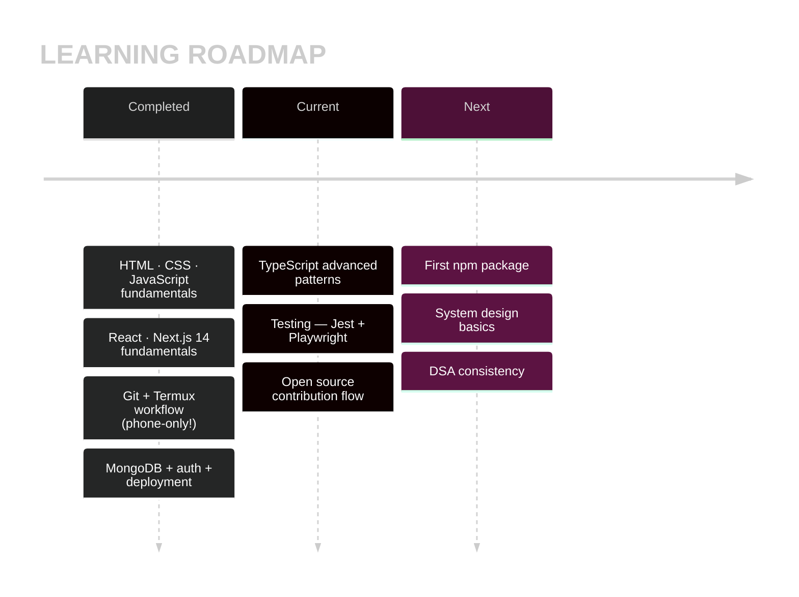
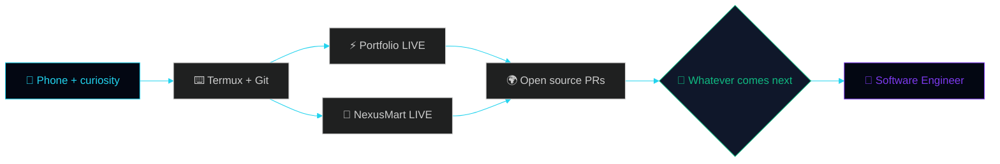

<div align="center">

<!-- ════════════════════════════════════════════════════════════════ -->
<!--  Manashjyoti Bora · Full-Stack Development Student                 -->
<!--  Portfolio of work built and deployed entirely from a mobile       -->
<!--  device. All animations are hand-coded SVG (SMIL).                 -->
<!-- ════════════════════════════════════════════════════════════════ -->

<!-- ═══ CUSTOM HERO — hand-coded SVG · theme-aware dark/light ═══ -->
<picture>
  <source media="(prefers-color-scheme: dark)" srcset="https://raw.githubusercontent.com/Manashjyoti-Bora/Manashjyoti-Bora/main/assets/hero-dark.svg">
  <source media="(prefers-color-scheme: light)" srcset="https://raw.githubusercontent.com/Manashjyoti-Bora/Manashjyoti-Bora/main/assets/hero-light.svg">
  
</picture>

<sub>Hand-coded SVG banner — adapts to your GitHub light/dark theme.</sub>

&nbsp;
<a href="https://github.com/Manashjyoti-Bora?tab=followers"></a>&nbsp;


[](https://manashjyoti-bora.vercel.app)&nbsp;
[](https://www.linkedin.com/in/manashjyoti-bora-323b97405)&nbsp;
[](mailto:manashjyotibora122@gmail.com)&nbsp;
[](https://manashjyoti-bora.vercel.app/resume.pdf)

<!-- Live uptime — real monitors -->
&nbsp;


</div>

> [!IMPORTANT]
> **Summary:** First-year IT student, learning full-stack development in public. While studying, I have **designed, built, and deployed two production applications** — using only an Android phone as my development machine. Every claim on this page links to live, verifiable work. Where this journey leads next — the work will decide.

<!-- ═══ CUSTOM FX 1: HAND-CODED MATRIX RAIN DIVIDER ═══ -->


<div align="center">

# 📖 01 · Background — Why a Phone?

</div>

<div align="center">

</div>

> I'm a first-year B.Voc IT student from Nagaon, Assam.
> I don't own a laptop — so I built my entire development
> environment on an Android phone:
>
> - ⌨️ **Termux** — terminal, Git, Node.js
> - 🌐 **GitHub web editor** — code editing
> - ☁️ **Vercel** — cloud builds and deployment
>
> My approach: learn a concept, then immediately apply it
> to a real project. As a result, my repositories aren't
> tutorial copies — **they are live, deployed products.**

```text
[ DAY 001 ] "Hello World" ....... day one
[ DAY 0XX ] First git push ...... milestone
[ DAY 0XX ] First deploy ........ site live
[ DAY 0XX ] Real database ....... full-stack
[ TODAY   ] Still shipping ...... in progress
```


<div align="center">

# 🗂️ 02 · Projects — What Each One Taught Me

</div>

<div align="center">


**Each repository represents a stage of learning. All demos are live:**

</div>

<div align="center">

## ⚡ portfolio-website — Frontend Engineering

</div>

```text
┌─ OVERVIEW ──────────────────────────────┐
│ AUREA — interactive developer portfolio │
│ · 3D particle hero (Three.js / R3F)     │
│ · AI chatbot with intent matching       │
│ · Ctrl+K palette · hidden terminal      │
│ · Live GitHub dashboard (real API)      │
├─ SKILLS APPLIED ────────────────────────┤
│ Next.js 14 · TypeScript · Tailwind      │
│ GSAP · Framer Motion · API routes       │
│ SEO · security headers                  │
└─────────────────────────────────────────┘
```

<div align="center">

[](https://manashjyoti-bora.vercel.app)&nbsp;[](https://github.com/Manashjyoti-Bora/portfolio-website)

</div>

<div align="center">

## 🛒 nexusmart — Backend, Database & Security

</div>

```text
┌─ OVERVIEW ──────────────────────────────┐
│ Full-stack e-commerce: auth, cart,      │
│ checkout, orders                        │
│ · JWT (HTTP-only cookies) + bcrypt      │
│ · MongoDB Atlas, persistent orders      │
│ · Role-based admin dashboard            │
├─ SKILLS APPLIED ────────────────────────┤
│ Mongoose models · Zod validation        │
│ REST API design · auth flows            │
│ env secrets · production debugging      │
└─────────────────────────────────────────┘
```

<div align="center">

[](https://nexusmart-dusky.vercel.app)&nbsp;[](https://github.com/Manashjyoti-Bora/nexusmart)

</div>

<div align="center">

## 🧪 devhire-pro-ats & taskflow-enterprise — UI Patterns & State

</div>

| REPOSITORY | FOCUS AREA | LINK |
|:---|:---|:---:|
| **devhire-pro-ats** | ATS-style screening UI, complex layouts | [Open](https://github.com/Manashjyoti-Bora/devhire-pro-ats) |
| **taskflow-enterprise** | Task management, state handling, CRUD | [Open](https://github.com/Manashjyoti-Bora/taskflow-enterprise) |

<div align="center">

## 🤖 Manashjyoti-Bora (this repository) — CI/CD & Automation

</div>

This profile is itself a project: **three GitHub Actions pipelines** (contribution snake, 3D city, automated rebuilds) that I configured and debugged independently, plus **twelve hand-coded SMIL animation files** rendered on this page.

<!-- ═══ CUSTOM FX 3: FX LAB — 30 techniques in one hand-coded file ═══ -->


<div align="center">

# 📚 03 · Current Learning

</div>

<div align="center"></div>



<div align="center">

**Self-assessment — animated, honestly calibrated:**

</div>


<div align="center">

# 🛠️ 04 · Development Environment

</div>

<div align="center">


### Core stack

&nbsp;
&nbsp;
&nbsp;
&nbsp;


<br/>


| COMPONENT | TOOL |
|:---|:---|
| 💻 Machine | Android phone |
| 🐧 Terminal | Termux — Node.js, Git, npm |
| ✏️ Editor | GitHub web editor |
| ☁️ Build & deploy | Vercel |
| 🗄️ Database | MongoDB Atlas |
| 🚦 CI/CD | GitHub Actions |

</div>


<div align="center">

# 📊 05 · Live Metrics

</div>


<div align="center">


**All widgets below pull live data:**


**Contribution activity rendered as a 3D city — rebuilt nightly by GitHub Actions:**


**Pac-Man — eating through the contribution graph:**


**Contribution snake — regenerated daily at 00:00 UTC:**


**Contribution heatmap:**


</div>


<div align="center">

# 🧭 06 · Roadmap

</div>




<div align="center">

# 📬 07 · Contact

</div>


<div align="center">


**Always open to a conversation — collaboration, feedback, or ideas about building things.**

[](mailto:manashjyotibora122@gmail.com?subject=Hello%20Manashjyoti)&nbsp;
[](https://www.linkedin.com/in/manashjyoti-bora-323b97405)

**Animated 3D social icons (tap them — they spin!):**

<a href="https://www.linkedin.com/in/manashjyoti-bora-323b97405"></a>&nbsp;&nbsp;
<a href="mailto:manashjyotibora122@gmail.com"></a>&nbsp;&nbsp;
<a href="https://github.com/Manashjyoti-Bora"></a>


<details>
<summary>💡 <b>A closing note (tap to open)</b></summary>
<br/>

```text
┌──────────────────────────────────────┐
│           THE TAKEAWAY               │
│                                      │
│  Hardware does not make a developer. │
│  Consistency does.                   │
│                                      │
│  If a phone is all you have,         │
│  start with the phone.               │
│  Starting is the real skill.         │
└──────────────────────────────────────┘
```

</details>

<br/>

<samp>Updated continuously — one commit at a time.</samp><br/>
<sub>© 2026 Manashjyoti Bora · Nagaon, Assam, India</sub>


</div>
<!-- v1.0.0 -->
