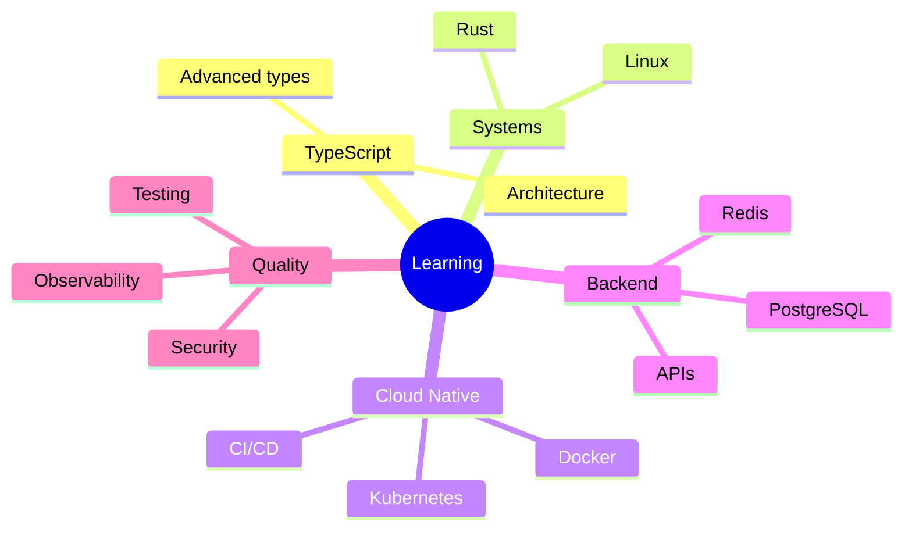
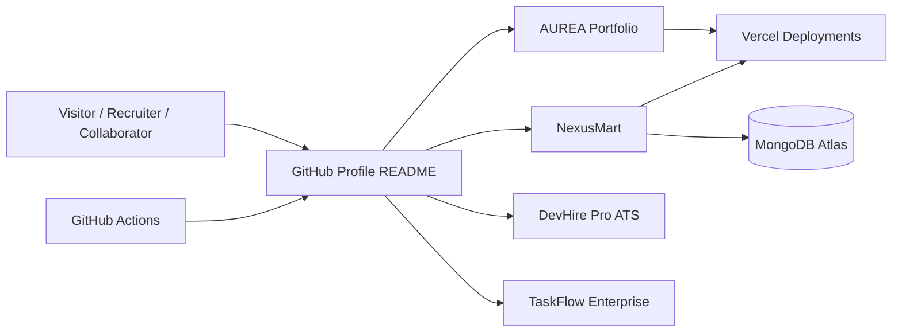
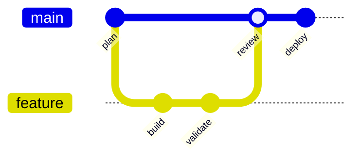
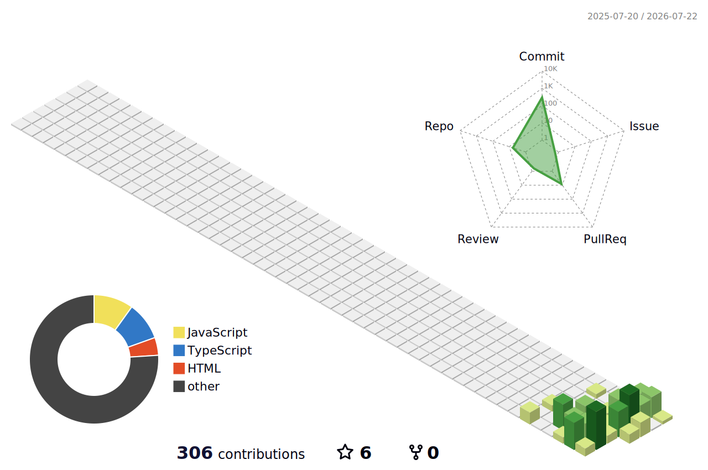

<!--
==============================================================================
MANASHJYOTI BORA — ALL-IN-ONE GITHUB PROFILE README
Generated from public GitHub information on 2026-07-12 (Asia/Kolkata).

Topic manifest: 1,156 supplied entries / 1,155 unique labels.
The label "Links" occurs twice in the supplied source and is preserved twice.
Normalized topic-list SHA-256: 6ea2f9dee2b4013a315cf68c9bf8ec10c327fe580e05a6cdf9d9a3c7b4327f45

IMPORTANT
- The engineering atlas is a coverage/reference index, not a claim of mastery.
- Verified skills/projects are separated from learning and reference topics.
- GitHub blocks scripts and strips some HTML/CSS; all primary content remains usable.
==============================================================================
-->

<a id="top"></a>

<div align="center">

<picture>
  <source media="(prefers-color-scheme: dark)" srcset="https://capsule-render.vercel.app/api?type=waving&color=0:7C3AED,50:2563EB,100:06B6D4&height=240&section=header&text=Manashjyoti%20Bora&fontSize=52&fontColor=ffffff&animation=twinkling&fontAlignY=35&desc=Full%20Stack%20Developer%20%E2%80%A2%20Android%20to%20Cloud%20%E2%80%A2%20Nagaon%2C%20Assam&descAlignY=57&descSize=18">
  
</picture>

<a href="https://github.com/Manashjyoti-Bora">
  
</a>

# Hey, I'm Manashjyoti Bora 👋

### Full Stack Developer · React · Next.js · TypeScript · Node.js

**Building secure, production-style web applications—from Android to Cloud.**


<p>
  <a href="https://manashjyoti-bora.vercel.app"></a>
  <a href="https://www.linkedin.com/in/manashjyoti-bora"></a>
  <a href="mailto:manashjyotibora122@gmail.com"></a>
  <a href="https://github.com/Manashjyoti-Bora?tab=followers"></a>
</p>

<p>
  
  
  
  
  
</p>

<p>
  <a href="https://github.com/Manashjyoti-Bora/Manashjyoti-Bora/actions/workflows/snake.yml"></a>
  <a href="https://github.com/Manashjyoti-Bora/Manashjyoti-Bora/actions/workflows/pacman.yml"></a>
  <a href="https://github.com/Manashjyoti-Bora/Manashjyoti-Bora/actions/workflows/3d-contrib.yml"></a>
</p>

[**View Portfolio**](https://manashjyoti-bora.vercel.app) ·
[**Explore Repositories**](https://github.com/Manashjyoti-Bora?tab=repositories) ·
[**Discuss an Opportunity**](mailto:manashjyotibora122@gmail.com)

</div>

> [!NOTE]
> **Public profile snapshot (12 July 2026):** Full Stack Developer in Nagaon, Assam, India; open to work/internships; 5 public repositories. Dynamic GitHub cards may change automatically.

> [!IMPORTANT]
> The **1,156-topic Engineering Atlas** near the end preserves every label supplied for this README. Indexed topics are interests, documentation capabilities, or future reference areas—not automatic claims that every technology is used in production.

---

## 📑 Table of Contents

<details open>
<summary><strong>Navigate the profile</strong></summary>

- [About Me](#-about-me)
- [Value Proposition](#-value-proposition)
- [Featured Projects](#-featured-projects)
- [Verified Stack](#%EF%B8%8F-verified-stack)
- [Currently Learning](#-currently-learning)
- [Engineering Principles](#-engineering-principles)
- [Architecture and Workflow](#%EF%B8%8F-architecture-and-workflow)
- [GitHub Analytics](#-github-analytics)
- [Contribution Animations](#-contribution-animations)
- [Profile Repository Setup](#-profile-repository-setup)
- [Roadmap](#%EF%B8%8F-roadmap)
- [Open Source and Collaboration](#-open-source-and-collaboration)
- [Security, Privacy, and Accessibility](#-security-privacy-and-accessibility)
- [Contact and Support](#-contact-and-support)
- [1,156-Topic Engineering Atlas](#-1156-topic-engineering-atlas)
- [License and Attribution](#-license-and-attribution)

</details>

---

## 👨‍💻 About Me

```ts
const manashjyoti = {
  name: "Manashjyoti Bora",
  location: "Nagaon, Assam, India",
  role: "Full Stack Developer",
  focus: ["React", "Next.js", "TypeScript", "Node.js"],
  building: "Secure, production-style web applications",
  originStory: "Started coding on Android with Termux",
  availability: ["Full-time roles", "Internships", "Open-source collaboration"],
  mindset: "Code. Build. Ship. Learn. Repeat.",
} as const;
```

Hi! I turn ideas into responsive, maintainable web products. My public work currently centers on full-stack TypeScript/JavaScript applications, practical authentication, product-focused interfaces, animation, and deployment to the web.

- 🔭 Building full-stack projects and improving production-readiness.
- 🌱 Learning advanced TypeScript, Rust, containers, Kubernetes, and cloud-native practices.
- 👯 Interested in open source, React/Next.js collaboration, internships, and hackathons.
- 💬 Ask me about React, Next.js, TypeScript, Node.js, Tailwind CSS, MongoDB, or shipping from constrained environments.
- 📱 Started coding from an Android phone using Termux before having a laptop.
- 🗓 Joined GitHub in February 2025.
- 🌐 Portfolio: [manashjyoti-bora.vercel.app](https://manashjyoti-bora.vercel.app)

<details>
<summary><strong>🌍 A multilingual hello</strong></summary>

| Language | Greeting |
|---|---|
| অসমীয়া | নমস্কাৰ! |
| English | Hello! |
| हिन्दी | नमस्ते! |
| বাংলা | নমস্কার! |
| Español | ¡Hola! |
| Français | Bonjour ! |
| العربية | مرحباً! |

</details>

---

## 🎯 Value Proposition

> **I build polished web experiences with a product mindset, connecting modern React interfaces to secure application logic and deployable infrastructure.**

| Dimension | What I bring |
|---|---|
| Target teams | Product, startup, web engineering, and open-source teams |
| Core value | Frontend quality plus practical full-stack ownership |
| Demonstrated work | Portfolio, e-commerce, ATS/job portal, and Kanban productivity apps |
| Differentiator | Resourcefulness—building and deploying from Android/Termux to the cloud |
| Current goal | A full-time role or internship with strong learning and delivery opportunities |

### How I work

1. Understand the user problem and acceptance criteria.
2. Design the data, UI states, validation, and security boundaries.
3. Build in small, testable increments.
4. Check responsive behavior, accessibility, errors, and performance.
5. Deploy, observe, document, and improve.

---

## 🚀 Featured Projects

### 1. AUREA — Developer Portfolio

**Next.js 14 · TypeScript · Tailwind CSS · Framer Motion · GSAP · Three.js**

A premium developer portfolio featuring a 3D hero, command palette, AI chatbot experience, live GitHub dashboard, responsive motion, and a production-style presentation.

[](https://github.com/Manashjyoti-Bora/portfolio-website)
[](https://manashjyoti-bora.vercel.app)

### 2. NexusMart — Full-Stack E-commerce

**Next.js App Router · TypeScript · MongoDB Atlas · JWT · bcrypt · Zod**

Full-stack commerce application with authentication through HTTP-only cookies, product/cart/checkout flows, role-gated administration, MongoDB persistence, and validation on mutations.

[](https://github.com/Manashjyoti-Bora/nexusmart)
[](https://nexusmart-dusky.vercel.app)

### 3. DevHire Pro — Job Portal and ATS

**React 19 · Vite · JavaScript · Modern CSS**

Applicant tracking experience with multi-attribute filtering, light/dark glassmorphic themes, application pipeline states, and memoized rendering.

[](https://github.com/Manashjyoti-Bora/devhire-pro-ats)

### 4. TaskFlow Enterprise — Agile Productivity

**React · Vite · JavaScript · Centralized UI state**

Kanban-style productivity suite with dynamic task movement, priority tagging, sprint-oriented views, and a no-reload interaction model.

[](https://github.com/Manashjyoti-Bora/taskflow-enterprise)

### Repository cards

<div align="center">
  <a href="https://github.com/Manashjyoti-Bora/portfolio-website"></a>
  <a href="https://github.com/Manashjyoti-Bora/nexusmart"></a>
  <a href="https://github.com/Manashjyoti-Bora/devhire-pro-ats"></a>
  <a href="https://github.com/Manashjyoti-Bora/taskflow-enterprise"></a>
</div>

> Project descriptions and technologies above were checked against public repository metadata and package manifests on 12 July 2026.

---

## 🛠️ Verified Stack

### Used in public projects

<p align="center">
  
</p>

| Area | Technologies demonstrated or declared in public work |
|---|---|
| Languages | JavaScript, TypeScript, HTML, CSS |
| UI | React 18/19, Next.js 14 App Router, Tailwind CSS, modern CSS |
| Motion/3D | Framer Motion, GSAP, Three.js, React Three Fiber |
| Server/data | Next.js server features, Node.js ecosystem, MongoDB/Mongoose |
| Auth/validation | JWT/Jose, bcrypt, HTTP-only cookies, Zod |
| Forms/UI tools | React Hook Form, Lucide React |
| Tooling | Vite, TypeScript strict mode, ESLint, Prettier, PostCSS, npm, Git |
| Delivery | Vercel, GitHub Actions, Termux-based mobile development |

### Technology badges


---

## 🌱 Currently Learning



| Now | Next | Exploring |
|---|---|---|
| Advanced TypeScript | Automated testing depth | Rust and systems concepts |
| Full-stack architecture | Docker and Kubernetes | Cloud-native patterns |
| Secure authentication | PostgreSQL and Redis | AI-assisted product features |

---

## 🧭 Engineering Principles

- **Users first:** clear flows, responsive layouts, useful empty/error/loading states.
- **Secure defaults:** server-side authorization, input validation, protected cookies, least privilege, and secret hygiene.
- **Accessible interfaces:** semantic HTML, keyboard support, visible focus, contrast, alt text, and reduced motion.
- **Maintainable code:** typed boundaries, small modules, predictable naming, formatting, linting, and documentation.
- **Measured performance:** optimize only after profiling; track Core Web Vitals and bundle weight.
- **Reliable delivery:** repeatable builds, Git workflows, CI checks, preview deployments, and rollback awareness.
- **Honest documentation:** distinguish shipped capabilities, experiments, learning goals, and future ideas.

### Accessibility target

The goal is WCAG-aligned UI with semantic HTML, ARIA only when necessary, keyboard navigation, screen-reader-friendly labels, color contrast, focus management, skip links, captions, and `prefers-reduced-motion` support.

### Security baseline

Validate untrusted input, authorize on the server, protect credentials, use TLS, avoid secrets in Git history, set safe cookie/header policies, rate-limit risky operations, keep dependencies reviewed, and report vulnerabilities privately.

---

## 🏗️ Architecture and Workflow

### Public project ecosystem



### Development workflow



```bash
git switch -c feat/short-description
npm install
npm run dev
npm run lint
npm run typecheck   # when available
npm run build
git commit -m "feat(scope): concise description"
```

### Quality checklist

- [ ] Main user flow works from a clean installation.
- [ ] Loading, empty, success, error, and permission states are handled.
- [ ] Layout works on mobile, tablet, and desktop.
- [ ] Keyboard, focus, labels, contrast, and reduced motion are checked.
- [ ] Inputs are validated; authorization is enforced server-side.
- [ ] No secrets or personal test data are committed.
- [ ] Build, lint, types, and relevant tests pass.
- [ ] README, environment example, screenshots, and deployment notes are current.

---

## 📊 GitHub Analytics

<div align="center">
  
  
  <br>
  
  <br>
  
  <br>
  
</div>

> Third-party cards can experience temporary rate limits or downtime. GitHub itself remains the authoritative source.

---

## 🐍 Contribution Animations

### Contribution snake

<picture>
  <source media="(prefers-color-scheme: dark)" srcset="https://raw.githubusercontent.com/Manashjyoti-Bora/Manashjyoti-Bora/output/github-contribution-grid-snake-dark.svg">
  
</picture>

### Pacman contribution graph

<picture>
  <source media="(prefers-color-scheme: dark)" srcset="https://raw.githubusercontent.com/Manashjyoti-Bora/Manashjyoti-Bora/output/pacman-contribution-graph-dark.svg">
  
</picture>

### 3D contribution city

<picture>
  <source media="(prefers-color-scheme: dark)" srcset="./profile-3d-contrib/profile-night-rainbow.svg">
  
</picture>

Generated automatically by scheduled GitHub Actions. Motion-sensitive visitors can use system reduced-motion settings or view the standard [contribution calendar](https://github.com/Manashjyoti-Bora).

### Optional integrations

WakaTime stats, Spotify Now Playing, blog-post feeds, GitHub Skyline, Metrics, star-history charts, and sponsorship widgets are intentionally not embedded until the corresponding account, feed, repository history, or funding destination is configured.

---

## 🧰 Profile Repository Setup

This README belongs in the special repository:

```text
Manashjyoti-Bora/Manashjyoti-Bora
├── .github/
│   └── workflows/
│       ├── 3d-contrib.yml
│       ├── pacman.yml
│       └── snake.yml
├── profile-3d-contrib/
│   └── *.svg
└── README.md
```

### Quick start

```bash
git clone https://github.com/Manashjyoti-Bora/Manashjyoti-Bora.git
cd Manashjyoti-Bora
code README.md
```

No application runtime, package manager, database, or environment variables are required for the profile itself. GitHub renders `README.md` using GitHub Flavored Markdown. Scheduled workflows use the repository-provided `GITHUB_TOKEN`.

### Update workflow

```bash
git switch main
git pull --ff-only
git switch -c docs/profile-refresh
# Edit and preview README.md
git add README.md
git commit -m "docs(profile): refresh profile content"
git push -u origin docs/profile-refresh
```

### Compatibility

- GitHub web and mobile views.
- Modern browsers with graceful fallback to alt text.
- Light/dark image variants via `<picture>`.
- External images require network access and provider availability.
- JavaScript, iframes, arbitrary CSS, Lottie scripts, and executable widgets do not run inside GitHub README files.

### Workflow notes

- Snake and Pacman assets publish to the `output` branch.
- 3D contribution assets are committed under `profile-3d-contrib/`.
- Workflow permissions are limited to `contents: write` where generation requires it.
- Pin third-party actions to immutable commit SHAs for stronger supply-chain security.

---

## 🗺️ Roadmap

- [x] Animated, responsive profile hero.
- [x] Portfolio and public project showcase.
- [x] GitHub stats, activity, streak, trophy, Snake, Pacman, and 3D contributions.
- [x] Exact 1,156-entry topic manifest with verification metadata.
- [ ] Add project screenshots with optimized repository-hosted assets.
- [ ] Add automated link and Markdown checks.
- [ ] Add tests and CI badges to application repositories.
- [ ] Add `LICENSE`, `SECURITY.md`, `CONTRIBUTING.md`, and issue/PR templates where appropriate.
- [ ] Publish deeper case studies covering decisions, trade-offs, accessibility, testing, security, and performance.
- [ ] Enable WakaTime, blog, Spotify, or sponsorship widgets only after real accounts are configured.

### Future scope

Stronger automated testing, containerized local environments, observability, production metrics, accessible component documentation, API contracts, and open-source contributions.

---

## 🤝 Open Source and Collaboration

I am open to:

- Full-time and internship opportunities.
- Open-source React, Next.js, TypeScript, and web-platform projects.
- Hackathons and learning-focused collaborations.
- Constructive reviews, bug reports, documentation improvements, and accessibility fixes.

### Contributing to my repositories

1. Read the target repository README and existing issues.
2. Open an issue before a large change.
3. Fork the repository and create a focused branch.
4. Keep secrets and personal data out of code, logs, screenshots, and commits.
5. Run available build/lint/type/test commands.
6. Submit a clear pull request with screenshots or reproduction steps where useful.

### Communication standard

Be respectful, specific, patient, inclusive, and constructive. Harassment, discrimination, spam, doxxing, and public disclosure of unpatched vulnerabilities are not welcome.

---

## 🔐 Security, Privacy, and Accessibility

### Security reporting

Please do not disclose an unpatched vulnerability in a public issue. Contact [Manashjyoti by email](mailto:manashjyotibora122@gmail.com) with the affected repository/version, impact, reproduction, and suggested mitigation. Remove secrets and unrelated personal information.

### Privacy

This profile links to third-party badge/stat/visitor services that may receive normal web-request metadata. Remove those images if a no-third-party-request profile is preferred.

### Accessibility

- Primary information is available as text, not only images.
- Images use descriptive alt text.
- Heading order and tables are kept semantic.
- Animated content is supplementary.
- Color is not the only status indicator.
- External widgets are followed by textual context or links.

---

## 📫 Contact and Support

| Channel | Purpose | Link |
|---|---|---|
| Portfolio | Projects and introduction | [manashjyoti-bora.vercel.app](https://manashjyoti-bora.vercel.app) |
| GitHub | Repositories and collaboration | [@Manashjyoti-Bora](https://github.com/Manashjyoti-Bora) |
| LinkedIn | Professional connection | [Manashjyoti Bora](https://www.linkedin.com/in/manashjyoti-bora) |
| Email | Work, internship, and security contact | [Send email](mailto:manashjyotibora122@gmail.com) |
| Issues | Repository-specific bug reports | [Profile repository issues](https://github.com/Manashjyoti-Bora/Manashjyoti-Bora/issues) |

When asking for help, include the repository, commit/version, environment, expected behavior, actual behavior, minimal reproduction, and sanitized logs.

---

## 🧠 1,156-Topic Engineering Atlas

This is the exact all-in-one topic set supplied for the profile README.

| Verification item | Result |
|---|---:|
| Supplied entries | **1,156** |
| Unique labels | **1,155** |
| Intentional duplicate | **`Links` × 2** |
| Missing from manifest | **0** |
| Normalized SHA-256 | `6ea2f9dee2b4013a315cf68c9bf8ec10c327fe580e05a6cdf9d9a3c7b4327f45` |

**Legend:** `[x]` means the exact label is present in this manifest. It does **not** mean every tool is used, every integration is configured, or every subject is mastered. Verified work is documented earlier; learning and reference topics remain clearly separated.


<details>
<summary><strong>Topics 0001–0100</strong></summary>

- [x] <a id="topic-0001"></a> **0001** — `Title`
- [x] <a id="topic-0002"></a> **0002** — `Project Name`
- [x] <a id="topic-0003"></a> **0003** — `App Name`
- [x] <a id="topic-0004"></a> **0004** — `Project Title`
- [x] <a id="topic-0005"></a> **0005** — `Header`
- [x] <a id="topic-0006"></a> **0006** — `Hero Section`
- [x] <a id="topic-0007"></a> **0007** — `Banner Image`
- [x] <a id="topic-0008"></a> **0008** — `Project Logo`
- [x] <a id="topic-0009"></a> **0009** — `Logo`
- [x] <a id="topic-0010"></a> **0010** — `Description`
- [x] <a id="topic-0011"></a> **0011** — `Project Description`
- [x] <a id="topic-0012"></a> **0012** — `About`
- [x] <a id="topic-0013"></a> **0013** — `Introduction`
- [x] <a id="topic-0014"></a> **0014** — `Overview`
- [x] <a id="topic-0015"></a> **0015** — `Motivation`
- [x] <a id="topic-0016"></a> **0016** — `Why This Project`
- [x] <a id="topic-0017"></a> **0017** — `How It Works`
- [x] <a id="topic-0018"></a> **0018** — `Features`
- [x] <a id="topic-0019"></a> **0019** — `Feature List`
- [x] <a id="topic-0020"></a> **0020** — `Feature Highlights`
- [x] <a id="topic-0021"></a> **0021** — `Key Features`
- [x] <a id="topic-0022"></a> **0022** — `Feature Comparison`
- [x] <a id="topic-0023"></a> **0023** — `Screenshots`
- [x] <a id="topic-0024"></a> **0024** — `Demo`
- [x] <a id="topic-0025"></a> **0025** — `Demo GIF`
- [x] <a id="topic-0026"></a> **0026** — `Demo Video`
- [x] <a id="topic-0027"></a> **0027** — `Demo Screenshots`
- [x] <a id="topic-0028"></a> **0028** — `Live Demo`
- [x] <a id="topic-0029"></a> **0029** — `Live Preview`
- [x] <a id="topic-0030"></a> **0030** — `Visuals`
- [x] <a id="topic-0031"></a> **0031** — `Video Demo`
- [x] <a id="topic-0032"></a> **0032** — `GIF Demo`
- [x] <a id="topic-0033"></a> **0033** — `Table of Contents`
- [x] <a id="topic-0034"></a> **0034** — `Navigation`
- [x] <a id="topic-0035"></a> **0035** — `Getting Started`
- [x] <a id="topic-0036"></a> **0036** — `Quick Start`
- [x] <a id="topic-0037"></a> **0037** — `Quick Start Guide`
- [x] <a id="topic-0038"></a> **0038** — `Prerequisites`
- [x] <a id="topic-0039"></a> **0039** — `Requirements`
- [x] <a id="topic-0040"></a> **0040** — `Minimum Requirements`
- [x] <a id="topic-0041"></a> **0041** — `System Requirements`
- [x] <a id="topic-0042"></a> **0042** — `Browser Support`
- [x] <a id="topic-0043"></a> **0043** — `Platform Support`
- [x] <a id="topic-0044"></a> **0044** — `Cross Platform`
- [x] <a id="topic-0045"></a> **0045** — `Mobile Support`
- [x] <a id="topic-0046"></a> **0046** — `Responsive Design`
- [x] <a id="topic-0047"></a> **0047** — `Accessibility`
- [x] <a id="topic-0048"></a> **0048** — `Installation`
- [x] <a id="topic-0049"></a> **0049** — `Installation Guide`
- [x] <a id="topic-0050"></a> **0050** — `Installation (Windows)`
- [x] <a id="topic-0051"></a> **0051** — `Installation (Mac)`
- [x] <a id="topic-0052"></a> **0052** — `Installation (Linux)`
- [x] <a id="topic-0053"></a> **0053** — `Windows Setup`
- [x] <a id="topic-0054"></a> **0054** — `Android Setup`
- [x] <a id="topic-0055"></a> **0055** — `iOS Setup`
- [x] <a id="topic-0056"></a> **0056** — `Web Setup`
- [x] <a id="topic-0057"></a> **0057** — `Desktop Setup`
- [x] <a id="topic-0058"></a> **0058** — `Setup`
- [x] <a id="topic-0059"></a> **0059** — `Environment Setup`
- [x] <a id="topic-0060"></a> **0060** — `Environment Variables`
- [x] <a id="topic-0061"></a> **0061** — `Configuration`
- [x] <a id="topic-0062"></a> **0062** — `Configuration Options`
- [x] <a id="topic-0063"></a> **0063** — `Options`
- [x] <a id="topic-0064"></a> **0064** — `Zero Config`
- [x] <a id="topic-0065"></a> **0065** — `Run Locally`
- [x] <a id="topic-0066"></a> **0066** — `Running the App`
- [x] <a id="topic-0067"></a> **0067** — `How to Run`
- [x] <a id="topic-0068"></a> **0068** — `Dev Server`
- [x] <a id="topic-0069"></a> **0069** — `Development`
- [x] <a id="topic-0070"></a> **0070** — `Development Setup`
- [x] <a id="topic-0071"></a> **0071** — `Development Workflow`
- [x] <a id="topic-0072"></a> **0072** — `Workflow`
- [x] <a id="topic-0073"></a> **0073** — `Git Workflow`
- [x] <a id="topic-0074"></a> **0074** — `Branching Strategy`
- [x] <a id="topic-0075"></a> **0075** — `Clone Repository`
- [x] <a id="topic-0076"></a> **0076** — `Commands`
- [x] <a id="topic-0077"></a> **0077** — `Command Line Usage`
- [x] <a id="topic-0078"></a> **0078** — `CLI Usage`
- [x] <a id="topic-0079"></a> **0079** — `GUI Usage`
- [x] <a id="topic-0080"></a> **0080** — `npm Scripts`
- [x] <a id="topic-0081"></a> **0081** — `Yarn Commands`
- [x] <a id="topic-0082"></a> **0082** — `Package Manager`
- [x] <a id="topic-0083"></a> **0083** — `Package.json Scripts`
- [x] <a id="topic-0084"></a> **0084** — `Download`
- [x] <a id="topic-0085"></a> **0085** — `Zip Download`
- [x] <a id="topic-0086"></a> **0086** — `Usage`
- [x] <a id="topic-0087"></a> **0087** — `Usage Examples`
- [x] <a id="topic-0088"></a> **0088** — `Usage Guide`
- [x] <a id="topic-0089"></a> **0089** — `Example Usage`
- [x] <a id="topic-0090"></a> **0090** — `Examples`
- [x] <a id="topic-0091"></a> **0091** — `User Guide`
- [x] <a id="topic-0092"></a> **0092** — `How to Use`
- [x] <a id="topic-0093"></a> **0093** — `Tutorial`
- [x] <a id="topic-0094"></a> **0094** — `Built With`
- [x] <a id="topic-0095"></a> **0095** — `Tech Stack`
- [x] <a id="topic-0096"></a> **0096** — `Technologies Used`
- [x] <a id="topic-0097"></a> **0097** — `Stack`
- [x] <a id="topic-0098"></a> **0098** — `Framework`
- [x] <a id="topic-0099"></a> **0099** — `Tools Used`
- [x] <a id="topic-0100"></a> **0100** — `Third Party Libraries`

</details>

<details>
<summary><strong>Topics 0101–0200</strong></summary>

- [x] <a id="topic-0101"></a> **0101** — `Dependencies`
- [x] <a id="topic-0102"></a> **0102** — `Dev Dependencies`
- [x] <a id="topic-0103"></a> **0103** — `Peer Dependencies`
- [x] <a id="topic-0104"></a> **0104** — `Optional Dependencies`
- [x] <a id="topic-0105"></a> **0105** — `Global Dependencies`
- [x] <a id="topic-0106"></a> **0106** — `Lock File`
- [x] <a id="topic-0107"></a> **0107** — `Frontend Setup`
- [x] <a id="topic-0108"></a> **0108** — `Backend Setup`
- [x] <a id="topic-0109"></a> **0109** — `Database Setup`
- [x] <a id="topic-0110"></a> **0110** — `Database Schema`
- [x] <a id="topic-0111"></a> **0111** — `Data Models`
- [x] <a id="topic-0112"></a> **0112** — `Data Flow`
- [x] <a id="topic-0113"></a> **0113** — `Directory Structure`
- [x] <a id="topic-0114"></a> **0114** — `File Structure`
- [x] <a id="topic-0115"></a> **0115** — `Folder Structure`
- [x] <a id="topic-0116"></a> **0116** — `Project Structure`
- [x] <a id="topic-0117"></a> **0117** — `Repository Structure`
- [x] <a id="topic-0118"></a> **0118** — `Tree Structure`
- [x] <a id="topic-0119"></a> **0119** — `Codebase Overview`
- [x] <a id="topic-0120"></a> **0120** — `Architecture`
- [x] <a id="topic-0121"></a> **0121** — `Architecture Diagram`
- [x] <a id="topic-0122"></a> **0122** — `System Architecture`
- [x] <a id="topic-0123"></a> **0123** — `Network Diagram`
- [x] <a id="topic-0124"></a> **0124** — `Design Decisions`
- [x] <a id="topic-0125"></a> **0125** — `Design Patterns`
- [x] <a id="topic-0126"></a> **0126** — `Wireframes`
- [x] <a id="topic-0127"></a> **0127** — `Visual Design`
- [x] <a id="topic-0128"></a> **0128** — `UI Components`
- [x] <a id="topic-0129"></a> **0129** — `Color Reference`
- [x] <a id="topic-0130"></a> **0130** — `Fonts Used`
- [x] <a id="topic-0131"></a> **0131** — `Styling`
- [x] <a id="topic-0132"></a> **0132** — `State Management`
- [x] <a id="topic-0133"></a> **0133** — `Storybook`
- [x] <a id="topic-0134"></a> **0134** — `API Reference`
- [x] <a id="topic-0135"></a> **0135** — `API Endpoints`
- [x] <a id="topic-0136"></a> **0136** — `API Authentication`
- [x] <a id="topic-0137"></a> **0137** — `API Rate Limiting`
- [x] <a id="topic-0138"></a> **0138** — `REST API`
- [x] <a id="topic-0139"></a> **0139** — `GraphQL Schema`
- [x] <a id="topic-0140"></a> **0140** — `HTTP Methods`
- [x] <a id="topic-0141"></a> **0141** — `JSON Schema`
- [x] <a id="topic-0142"></a> **0142** — `XML Schema`
- [x] <a id="topic-0143"></a> **0143** — `YAML Config`
- [x] <a id="topic-0144"></a> **0144** — `URL Structure`
- [x] <a id="topic-0145"></a> **0145** — `Output`
- [x] <a id="topic-0146"></a> **0146** — `Error Handling`
- [x] <a id="topic-0147"></a> **0147** — `Error Codes`
- [x] <a id="topic-0148"></a> **0148** — `Events`
- [x] <a id="topic-0149"></a> **0149** — `Integration`
- [x] <a id="topic-0150"></a> **0150** — `Import/Export`
- [x] <a id="topic-0151"></a> **0151** — `Extensions`
- [x] <a id="topic-0152"></a> **0152** — `Plugins`
- [x] <a id="topic-0153"></a> **0153** — `Custom Themes`
- [x] <a id="topic-0154"></a> **0154** — `Localization`
- [x] <a id="topic-0155"></a> **0155** — `Internationalization (i18n)`
- [x] <a id="topic-0156"></a> **0156** — `Translations`
- [x] <a id="topic-0157"></a> **0157** — `Notes`
- [x] <a id="topic-0158"></a> **0158** — `Warnings`
- [x] <a id="topic-0159"></a> **0159** — `Edge Cases`
- [x] <a id="topic-0160"></a> **0160** — `Limitations`
- [x] <a id="topic-0161"></a> **0161** — `Known Issues`
- [x] <a id="topic-0162"></a> **0162** — `Known Bugs`
- [x] <a id="topic-0163"></a> **0163** — `Issues`
- [x] <a id="topic-0164"></a> **0164** — `Issue Tracking`
- [x] <a id="topic-0165"></a> **0165** — `Troubleshooting`
- [x] <a id="topic-0166"></a> **0166** — `FAQ`
- [x] <a id="topic-0167"></a> **0167** — `Support`
- [x] <a id="topic-0168"></a> **0168** — `Support Channels`
- [x] <a id="topic-0169"></a> **0169** — `Getting Help`
- [x] <a id="topic-0170"></a> **0170** — `Feedback`
- [x] <a id="topic-0171"></a> **0171** — `Contact`
- [x] <a id="topic-0172"></a> **0172** — `Contact Information`
- [x] <a id="topic-0173"></a> **0173** — `Social Links`
- [x] <a id="topic-0174"></a> **0174** — `Community`
- [x] <a id="topic-0175"></a> **0175** — `Community Guidelines`
- [x] <a id="topic-0176"></a> **0176** — `Code of Conduct`
- [x] <a id="topic-0177"></a> **0177** — `Contributing`
- [x] <a id="topic-0178"></a> **0178** — `Contributing Guidelines`
- [x] <a id="topic-0179"></a> **0179** — `How to Contribute`
- [x] <a id="topic-0180"></a> **0180** — `Pull Request Template`
- [x] <a id="topic-0181"></a> **0181** — `Pull Request Process`
- [x] <a id="topic-0182"></a> **0182** — `Bug Reports`
- [x] <a id="topic-0183"></a> **0183** — `Feature Requests`
- [x] <a id="topic-0184"></a> **0184** — `Acknowledgements`
- [x] <a id="topic-0185"></a> **0185** — `Credits`
- [x] <a id="topic-0186"></a> **0186** — `Authors`
- [x] <a id="topic-0187"></a> **0187** — `Team`
- [x] <a id="topic-0188"></a> **0188** — `Maintainers`
- [x] <a id="topic-0189"></a> **0189** — `Hall of Fame`
- [x] <a id="topic-0190"></a> **0190** — `Special Thanks`
- [x] <a id="topic-0191"></a> **0191** — `Inspired By`
- [x] <a id="topic-0192"></a> **0192** — `Related Projects`
- [x] <a id="topic-0193"></a> **0193** — `Alternatives`
- [x] <a id="topic-0194"></a> **0194** — `Used By`
- [x] <a id="topic-0195"></a> **0195** — `Powered By`
- [x] <a id="topic-0196"></a> **0196** — `Built By`
- [x] <a id="topic-0197"></a> **0197** — `Sponsors`
- [x] <a id="topic-0198"></a> **0198** — `Sponsorship`
- [x] <a id="topic-0199"></a> **0199** — `Donation`
- [x] <a id="topic-0200"></a> **0200** — `Buy Me a Coffee`

</details>

<details>
<summary><strong>Topics 0201–0300</strong></summary>

- [x] <a id="topic-0201"></a> **0201** — `PayPal`
- [x] <a id="topic-0202"></a> **0202** — `Patreon`
- [x] <a id="topic-0203"></a> **0203** — `Ko-fi`
- [x] <a id="topic-0204"></a> **0204** — `Open Collective`
- [x] <a id="topic-0205"></a> **0205** — `Hiring`
- [x] <a id="topic-0206"></a> **0206** — `Roadmap`
- [x] <a id="topic-0207"></a> **0207** — `Future Plans`
- [x] <a id="topic-0208"></a> **0208** — `Future Scope`
- [x] <a id="topic-0209"></a> **0209** — `TODO`
- [x] <a id="topic-0210"></a> **0210** — `Timeline`
- [x] <a id="topic-0211"></a> **0211** — `Changelog`
- [x] <a id="topic-0212"></a> **0212** — `Release Notes`
- [x] <a id="topic-0213"></a> **0213** — `Release History`
- [x] <a id="topic-0214"></a> **0214** — `Updates`
- [x] <a id="topic-0215"></a> **0215** — `Version`
- [x] <a id="topic-0216"></a> **0216** — `Version History`
- [x] <a id="topic-0217"></a> **0217** — `Versioning`
- [x] <a id="topic-0218"></a> **0218** — `Tags`
- [x] <a id="topic-0219"></a> **0219** — `Migration Guide`
- [x] <a id="topic-0220"></a> **0220** — `Upgrading`
- [x] <a id="topic-0221"></a> **0221** — `Upgrade Guide`
- [x] <a id="topic-0222"></a> **0222** — `Breaking Changes`
- [x] <a id="topic-0223"></a> **0223** — `Rollback`
- [x] <a id="topic-0224"></a> **0224** — `Status`
- [x] <a id="topic-0225"></a> **0225** — `Project Status`
- [x] <a id="topic-0226"></a> **0226** — `Build Status`
- [x] <a id="topic-0227"></a> **0227** — `Continuous Integration`
- [x] <a id="topic-0228"></a> **0228** — `CI/CD`
- [x] <a id="topic-0229"></a> **0229** — `CI/CD Pipeline`
- [x] <a id="topic-0230"></a> **0230** — `GitHub Actions`
- [x] <a id="topic-0231"></a> **0231** — `Automated Testing`
- [x] <a id="topic-0232"></a> **0232** — `Testing`
- [x] <a id="topic-0233"></a> **0233** — `Testing Guide`
- [x] <a id="topic-0234"></a> **0234** — `Unit Testing`
- [x] <a id="topic-0235"></a> **0235** — `Integration Testing`
- [x] <a id="topic-0236"></a> **0236** — `Run Tests`
- [x] <a id="topic-0237"></a> **0237** — `How to Test`
- [x] <a id="topic-0238"></a> **0238** — `Test Coverage`
- [x] <a id="topic-0239"></a> **0239** — `Test Results`
- [x] <a id="topic-0240"></a> **0240** — `Code Coverage`
- [x] <a id="topic-0241"></a> **0241** — `Benchmarks`
- [x] <a id="topic-0242"></a> **0242** — `Performance`
- [x] <a id="topic-0243"></a> **0243** — `Performance Benchmarks`
- [x] <a id="topic-0244"></a> **0244** — `Load Testing`
- [x] <a id="topic-0245"></a> **0245** — `Monitoring`
- [x] <a id="topic-0246"></a> **0246** — `Logging`
- [x] <a id="topic-0247"></a> **0247** — `Health Check`
- [x] <a id="topic-0248"></a> **0248** — `Security`
- [x] <a id="topic-0249"></a> **0249** — `Security Policy`
- [x] <a id="topic-0250"></a> **0250** — `Security Vulnerabilities`
- [x] <a id="topic-0251"></a> **0251** — `Authentication`
- [x] <a id="topic-0252"></a> **0252** — `Authorization`
- [x] <a id="topic-0253"></a> **0253** — `JWT Authentication`
- [x] <a id="topic-0254"></a> **0254** — `OAuth`
- [x] <a id="topic-0255"></a> **0255** — `Two Factor Auth`
- [x] <a id="topic-0256"></a> **0256** — `Encryption`
- [x] <a id="topic-0257"></a> **0257** — `CORS Policy`
- [x] <a id="topic-0258"></a> **0258** — `CSRF Protection`
- [x] <a id="topic-0259"></a> **0259** — `XSS Protection`
- [x] <a id="topic-0260"></a> **0260** — `Input Validation`
- [x] <a id="topic-0261"></a> **0261** — `Rate Limiting`
- [x] <a id="topic-0262"></a> **0262** — `SSL/TLS`
- [x] <a id="topic-0263"></a> **0263** — `Production`
- [x] <a id="topic-0264"></a> **0264** — `Production Build`
- [x] <a id="topic-0265"></a> **0265** — `Deploy`
- [x] <a id="topic-0266"></a> **0266** — `Deployment`
- [x] <a id="topic-0267"></a> **0267** — `Deployment Guide`
- [x] <a id="topic-0268"></a> **0268** — `Deployment Platforms`
- [x] <a id="topic-0269"></a> **0269** — `Hosting`
- [x] <a id="topic-0270"></a> **0270** — `Container Setup`
- [x] <a id="topic-0271"></a> **0271** — `Docker`
- [x] <a id="topic-0272"></a> **0272** — `Docker Compose`
- [x] <a id="topic-0273"></a> **0273** — `Dockerfile`
- [x] <a id="topic-0274"></a> **0274** — `Kubernetes`
- [x] <a id="topic-0275"></a> **0275** — `Swagger/OpenAPI`
- [x] <a id="topic-0276"></a> **0276** — `Documentation`
- [x] <a id="topic-0277"></a> **0277** — `Documentation Links`
- [x] <a id="topic-0278"></a> **0278** — `Wiki`
- [x] <a id="topic-0279"></a> **0279** — `Resources`
- [x] <a id="topic-0280"></a> **0280** — `External Links`
- [x] <a id="topic-0281"></a> **0281** — `Links`
- [x] <a id="topic-0282"></a> **0282** — `Appendix`
- [x] <a id="topic-0283"></a> **0283** — `Glossary`
- [x] <a id="topic-0284"></a> **0284** — `Disclaimer`
- [x] <a id="topic-0285"></a> **0285** — `Terms of Service`
- [x] <a id="topic-0286"></a> **0286** — `Privacy Policy`
- [x] <a id="topic-0287"></a> **0287** — `Copyright`
- [x] <a id="topic-0288"></a> **0288** — `Warranty`
- [x] <a id="topic-0289"></a> **0289** — `Open Source`
- [x] <a id="topic-0290"></a> **0290** — `License`
- [x] <a id="topic-0291"></a> **0291** — `License Badge`
- [x] <a id="topic-0292"></a> **0292** — `Markdown Badges`
- [x] <a id="topic-0293"></a> **0293** — `Status Badges`
- [x] <a id="topic-0294"></a> **0294** — `Animated GIF`
- [x] <a id="topic-0295"></a> **0295** — `Animated SVG`
- [x] <a id="topic-0296"></a> **0296** — `Typing Animation`
- [x] <a id="topic-0297"></a> **0297** — `Wave Animation`
- [x] <a id="topic-0298"></a> **0298** — `Animated Banner`
- [x] <a id="topic-0299"></a> **0299** — `Animated Logo`
- [x] <a id="topic-0300"></a> **0300** — `Animated Badges`

</details>

<details>
<summary><strong>Topics 0301–0400</strong></summary>

- [x] <a id="topic-0301"></a> **0301** — `Animated Separator`
- [x] <a id="topic-0302"></a> **0302** — `Animated Stats`
- [x] <a id="topic-0303"></a> **0303** — `Animated Contribution Graph`
- [x] <a id="topic-0304"></a> **0304** — `Particle Animation`
- [x] <a id="topic-0305"></a> **0305** — `Snake Animation`
- [x] <a id="topic-0306"></a> **0306** — `Matrix Animation`
- [x] <a id="topic-0307"></a> **0307** — `Gradient Animation`
- [x] <a id="topic-0308"></a> **0308** — `Pulse Animation`
- [x] <a id="topic-0309"></a> **0309** — `Bounce Animation`
- [x] <a id="topic-0310"></a> **0310** — `Fade In Animation`
- [x] <a id="topic-0311"></a> **0311** — `Slide Animation`
- [x] <a id="topic-0312"></a> **0312** — `Rotate Animation`
- [x] <a id="topic-0313"></a> **0313** — `Glow Animation`
- [x] <a id="topic-0314"></a> **0314** — `Sparkle Animation`
- [x] <a id="topic-0315"></a> **0315** — `Confetti Animation`
- [x] <a id="topic-0316"></a> **0316** — `Fireworks Animation`
- [x] <a id="topic-0317"></a> **0317** — `Rain Animation`
- [x] <a id="topic-0318"></a> **0318** — `Snow Animation`
- [x] <a id="topic-0319"></a> **0319** — `Neon Glow`
- [x] <a id="topic-0320"></a> **0320** — `3D Text`
- [x] <a id="topic-0321"></a> **0321** — `Parallax Effect`
- [x] <a id="topic-0322"></a> **0322** — `Progress Bar Animation`
- [x] <a id="topic-0323"></a> **0323** — `Counter Animation`
- [x] <a id="topic-0324"></a> **0324** — `Typewriter Effect`
- [x] <a id="topic-0325"></a> **0325** — `Glitch Effect`
- [x] <a id="topic-0326"></a> **0326** — `Holographic Effect`
- [x] <a id="topic-0327"></a> **0327** — `Rainbow Text`
- [x] <a id="topic-0328"></a> **0328** — `Blinking Text`
- [x] <a id="topic-0329"></a> **0329** — `Scrolling Text`
- [x] <a id="topic-0330"></a> **0330** — `Morphing Text`
- [x] <a id="topic-0331"></a> **0331** — `Wave Text`
- [x] <a id="topic-0332"></a> **0332** — `Floating Elements`
- [x] <a id="topic-0333"></a> **0333** — `Lottie Animation`
- [x] <a id="topic-0334"></a> **0334** — `GitHub Stats Card`
- [x] <a id="topic-0335"></a> **0335** — `Top Languages Card`
- [x] <a id="topic-0336"></a> **0336** — `Streak Stats`
- [x] <a id="topic-0337"></a> **0337** — `Trophy`
- [x] <a id="topic-0338"></a> **0338** — `Activity Graph`
- [x] <a id="topic-0339"></a> **0339** — `Contribution Calendar`
- [x] <a id="topic-0340"></a> **0340** — `Profile Views Counter`
- [x] <a id="topic-0341"></a> **0341** — `Wakatime Stats`
- [x] <a id="topic-0342"></a> **0342** — `Spotify Now Playing`
- [x] <a id="topic-0343"></a> **0343** — `Blog Posts`
- [x] <a id="topic-0344"></a> **0344** — `GitHub Skyline`
- [x] <a id="topic-0345"></a> **0345** — `Metrics`
- [x] <a id="topic-0346"></a> **0346** — `Pinned Repos`
- [x] <a id="topic-0347"></a> **0347** — `Social Stats`
- [x] <a id="topic-0348"></a> **0348** — `Skill Icons`
- [x] <a id="topic-0349"></a> **0349** — `GitHub Readme Stats`
- [x] <a id="topic-0350"></a> **0350** — `Repo Card`
- [x] <a id="topic-0351"></a> **0351** — `Contributors Wall`
- [x] <a id="topic-0352"></a> **0352** — `Contributor Graph`
- [x] <a id="topic-0353"></a> **0353** — `Star History`
- [x] <a id="topic-0354"></a> **0354** — `Flowchart`
- [x] <a id="topic-0355"></a> **0355** — `Sequence Diagram`
- [x] <a id="topic-0356"></a> **0356** — `Class Diagram`
- [x] <a id="topic-0357"></a> **0357** — `State Diagram`
- [x] <a id="topic-0358"></a> **0358** — `Entity Relationship`
- [x] <a id="topic-0359"></a> **0359** — `Gantt Chart`
- [x] <a id="topic-0360"></a> **0360** — `Pie Chart`
- [x] <a id="topic-0361"></a> **0361** — `Git Graph`
- [x] <a id="topic-0362"></a> **0362** — `User Journey`
- [x] <a id="topic-0363"></a> **0363** — `Mindmap`
- [x] <a id="topic-0364"></a> **0364** — `Build Instructions`
- [x] <a id="topic-0365"></a> **0365** — `Browser Compatibility`
- [x] <a id="topic-0366"></a> **0366** — `Compatibility`
- [x] <a id="topic-0367"></a> **0367** — `Hosting Setup`
- [x] <a id="topic-0368"></a> **0368** — `Server Setup`
- [x] <a id="topic-0369"></a> **0369** — `Serverless`
- [x] <a id="topic-0370"></a> **0370** — `Monorepo Setup`
- [x] <a id="topic-0371"></a> **0371** — `Workspace Setup`
- [x] <a id="topic-0372"></a> **0372** — `Turborepo/Nx Config`
- [x] <a id="topic-0373"></a> **0373** — `Husky Setup`
- [x] <a id="topic-0374"></a> **0374** — `Prettier Config`
- [x] <a id="topic-0375"></a> **0375** — `ESLint Config`
- [x] <a id="topic-0376"></a> **0376** — `EditorConfig`
- [x] <a id="topic-0377"></a> **0377** — `Commitlint`
- [x] <a id="topic-0378"></a> **0378** — `Semantic Release`
- [x] <a id="topic-0379"></a> **0379** — `Conventional Commits`
- [x] <a id="topic-0380"></a> **0380** — `Pre-commit Hooks`
- [x] <a id="topic-0381"></a> **0381** — `Post-install Scripts`
- [x] <a id="topic-0382"></a> **0382** — `Caching Strategy`
- [x] <a id="topic-0383"></a> **0383** — `CDN Setup`
- [x] <a id="topic-0384"></a> **0384** — `Image Optimization`
- [x] <a id="topic-0385"></a> **0385** — `Lazy Loading`
- [x] <a id="topic-0386"></a> **0386** — `Code Splitting`
- [x] <a id="topic-0387"></a> **0387** — `Tree Shaking`
- [x] <a id="topic-0388"></a> **0388** — `Bundle Analysis`
- [x] <a id="topic-0389"></a> **0389** — `Lighthouse Score`
- [x] <a id="topic-0390"></a> **0390** — `Web Vitals`
- [x] <a id="topic-0391"></a> **0391** — `PWA Setup`
- [x] <a id="topic-0392"></a> **0392** — `Service Worker`
- [x] <a id="topic-0393"></a> **0393** — `Push Notifications`
- [x] <a id="topic-0394"></a> **0394** — `Offline Support`
- [x] <a id="topic-0395"></a> **0395** — `Dark Mode`
- [x] <a id="topic-0396"></a> **0396** — `Light Mode`
- [x] <a id="topic-0397"></a> **0397** — `Theme Switching`
- [x] <a id="topic-0398"></a> **0398** — `RTL Support`
- [x] <a id="topic-0399"></a> **0399** — `Accessibility (a11y)`
- [x] <a id="topic-0400"></a> **0400** — `ARIA Labels`

</details>

<details>
<summary><strong>Topics 0401–0500</strong></summary>

- [x] <a id="topic-0401"></a> **0401** — `Keyboard Navigation`
- [x] <a id="topic-0402"></a> **0402** — `Screen Reader`
- [x] <a id="topic-0403"></a> **0403** — `Color Contrast`
- [x] <a id="topic-0404"></a> **0404** — `Focus Management`
- [x] <a id="topic-0405"></a> **0405** — `Skip Links`
- [x] <a id="topic-0406"></a> **0406** — `Semantic HTML`
- [x] <a id="topic-0407"></a> **0407** — `Form Validation`
- [x] <a id="topic-0408"></a> **0408** — `File Upload`
- [x] <a id="topic-0409"></a> **0409** — `Drag and Drop`
- [x] <a id="topic-0410"></a> **0410** — `Infinite Scroll`
- [x] <a id="topic-0411"></a> **0411** — `Pagination`
- [x] <a id="topic-0412"></a> **0412** — `Search Functionality`
- [x] <a id="topic-0413"></a> **0413** — `Filter/Sort`
- [x] <a id="topic-0414"></a> **0414** — `Real-time Updates`
- [x] <a id="topic-0415"></a> **0415** — `WebSocket Setup`
- [x] <a id="topic-0416"></a> **0416** — `Server-Sent Events`
- [x] <a id="topic-0417"></a> **0417** — `GraphQL Setup`
- [x] <a id="topic-0418"></a> **0418** — `REST vs GraphQL`
- [x] <a id="topic-0419"></a> **0419** — `Socket.io`
- [x] <a id="topic-0420"></a> **0420** — `Redis Setup`
- [x] <a id="topic-0421"></a> **0421** — `MongoDB Setup`
- [x] <a id="topic-0422"></a> **0422** — `PostgreSQL Setup`
- [x] <a id="topic-0423"></a> **0423** — `MySQL Setup`
- [x] <a id="topic-0424"></a> **0424** — `SQLite Setup`
- [x] <a id="topic-0425"></a> **0425** — `Prisma ORM`
- [x] <a id="topic-0426"></a> **0426** — `Sequelize ORM`
- [x] <a id="topic-0427"></a> **0427** — `TypeORM`
- [x] <a id="topic-0428"></a> **0428** — `Mongoose ODM`
- [x] <a id="topic-0429"></a> **0429** — `Database Migration`
- [x] <a id="topic-0430"></a> **0430** — `Database Seeding`
- [x] <a id="topic-0431"></a> **0431** — `Database Backup`
- [x] <a id="topic-0432"></a> **0432** — `Database Indexing`
- [x] <a id="topic-0433"></a> **0433** — `Connection Pooling`
- [x] <a id="topic-0434"></a> **0434** — `Query Optimization`
- [x] <a id="topic-0435"></a> **0435** — `N+1 Problem`
- [x] <a id="topic-0436"></a> **0436** — `Stored Procedures`
- [x] <a id="topic-0437"></a> **0437** — `Triggers`
- [x] <a id="topic-0438"></a> **0438** — `Views`
- [x] <a id="topic-0439"></a> **0439** — `Transactions`
- [x] <a id="topic-0440"></a> **0440** — `ACID Compliance`
- [x] <a id="topic-0441"></a> **0441** — `Replication`
- [x] <a id="topic-0442"></a> **0442** — `Sharding`
- [x] <a id="topic-0443"></a> **0443** — `Email Setup`
- [x] <a id="topic-0444"></a> **0444** — `SMS Setup`
- [x] <a id="topic-0445"></a> **0445** — `Payment Integration`
- [x] <a id="topic-0446"></a> **0446** — `Stripe Setup`
- [x] <a id="topic-0447"></a> **0447** — `Razorpay Setup`
- [x] <a id="topic-0448"></a> **0448** — `PayPal Integration`
- [x] <a id="topic-0449"></a> **0449** — `Google Maps`
- [x] <a id="topic-0450"></a> **0450** — `Google Analytics`
- [x] <a id="topic-0451"></a> **0451** — `Facebook Login`
- [x] <a id="topic-0452"></a> **0452** — `Google Login`
- [x] <a id="topic-0453"></a> **0453** — `GitHub Login`
- [x] <a id="topic-0454"></a> **0454** — `Apple Login`
- [x] <a id="topic-0455"></a> **0455** — `Twitter Login`
- [x] <a id="topic-0456"></a> **0456** — `LinkedIn Login`
- [x] <a id="topic-0457"></a> **0457** — `Magic Link Auth`
- [x] <a id="topic-0458"></a> **0458** — `Biometric Auth`
- [x] <a id="topic-0459"></a> **0459** — `Session Management`
- [x] <a id="topic-0460"></a> **0460** — `Token Refresh`
- [x] <a id="topic-0461"></a> **0461** — `Role Based Access`
- [x] <a id="topic-0462"></a> **0462** — `Permission System`
- [x] <a id="topic-0463"></a> **0463** — `Multi-tenancy`
- [x] <a id="topic-0464"></a> **0464** — `Microservices`
- [x] <a id="topic-0465"></a> **0465** — `Message Queue`
- [x] <a id="topic-0466"></a> **0466** — `Event Driven`
- [x] <a id="topic-0467"></a> **0467** — `CQRS Pattern`
- [x] <a id="topic-0468"></a> **0468** — `Domain Driven Design`
- [x] <a id="topic-0469"></a> **0469** — `Clean Architecture`
- [x] <a id="topic-0470"></a> **0470** — `Hexagonal Architecture`
- [x] <a id="topic-0471"></a> **0471** — `MVC Pattern`
- [x] <a id="topic-0472"></a> **0472** — `MVVM Pattern`
- [x] <a id="topic-0473"></a> **0473** — `Repository Pattern`
- [x] <a id="topic-0474"></a> **0474** — `Factory Pattern`
- [x] <a id="topic-0475"></a> **0475** — `Singleton Pattern`
- [x] <a id="topic-0476"></a> **0476** — `Observer Pattern`
- [x] <a id="topic-0477"></a> **0477** — `Strategy Pattern`
- [x] <a id="topic-0478"></a> **0478** — `Adapter Pattern`
- [x] <a id="topic-0479"></a> **0479** — `Decorator Pattern`
- [x] <a id="topic-0480"></a> **0480** — `Proxy Pattern`
- [x] <a id="topic-0481"></a> **0481** — `Middleware Pattern`
- [x] <a id="topic-0482"></a> **0482** — `Pipeline Pattern`
- [x] <a id="topic-0483"></a> **0483** — `Circuit Breaker`
- [x] <a id="topic-0484"></a> **0484** — `Retry Pattern`
- [x] <a id="topic-0485"></a> **0485** — `Bulkhead Pattern`
- [x] <a id="topic-0486"></a> **0486** — `Timeout Pattern`
- [x] <a id="topic-0487"></a> **0487** — `Fallback Pattern`
- [x] <a id="topic-0488"></a> **0488** — `Health Check Endpoint`
- [x] <a id="topic-0489"></a> **0489** — `Readiness Probe`
- [x] <a id="topic-0490"></a> **0490** — `Liveness Probe`
- [x] <a id="topic-0491"></a> **0491** — `Prometheus Metrics`
- [x] <a id="topic-0492"></a> **0492** — `Grafana Dashboard`
- [x] <a id="topic-0493"></a> **0493** — `ELK Stack`
- [x] <a id="topic-0494"></a> **0494** — `Sentry Setup`
- [x] <a id="topic-0495"></a> **0495** — `New Relic`
- [x] <a id="topic-0496"></a> **0496** — `Datadog`
- [x] <a id="topic-0497"></a> **0497** — `Log Levels`
- [x] <a id="topic-0498"></a> **0498** — `Structured Logging`
- [x] <a id="topic-0499"></a> **0499** — `Log Rotation`
- [x] <a id="topic-0500"></a> **0500** — `Audit Logging`

</details>

<details>
<summary><strong>Topics 0501–0600</strong></summary>

- [x] <a id="topic-0501"></a> **0501** — `Request Logging`
- [x] <a id="topic-0502"></a> **0502** — `Error Logging`
- [x] <a id="topic-0503"></a> **0503** — `Winston Logger`
- [x] <a id="topic-0504"></a> **0504** — `Pino Logger`
- [x] <a id="topic-0505"></a> **0505** — `Morgan Logger`
- [x] <a id="topic-0506"></a> **0506** — `Unit Test Setup`
- [x] <a id="topic-0507"></a> **0507** — `Integration Test Setup`
- [x] <a id="topic-0508"></a> **0508** — `E2E Test Setup`
- [x] <a id="topic-0509"></a> **0509** — `Jest Config`
- [x] <a id="topic-0510"></a> **0510** — `Mocha Config`
- [x] <a id="topic-0511"></a> **0511** — `Cypress Config`
- [x] <a id="topic-0512"></a> **0512** — `Playwright Config`
- [x] <a id="topic-0513"></a> **0513** — `Selenium Config`
- [x] <a id="topic-0514"></a> **0514** — `Puppeteer Config`
- [x] <a id="topic-0515"></a> **0515** — `Testing Library`
- [x] <a id="topic-0516"></a> **0516** — `Supertest`
- [x] <a id="topic-0517"></a> **0517** — `Mock Service Worker`
- [x] <a id="topic-0518"></a> **0518** — `Snapshot Testing`
- [x] <a id="topic-0519"></a> **0519** — `Visual Regression`
- [x] <a id="topic-0520"></a> **0520** — `Load Testing (k6)`
- [x] <a id="topic-0521"></a> **0521** — `Load Testing (Artillery)`
- [x] <a id="topic-0522"></a> **0522** — `Chaos Testing`
- [x] <a id="topic-0523"></a> **0523** — `Contract Testing`
- [x] <a id="topic-0524"></a> **0524** — `Mutation Testing`
- [x] <a id="topic-0525"></a> **0525** — `Accessibility Testing`
- [x] <a id="topic-0526"></a> **0526** — `Security Testing`
- [x] <a id="topic-0527"></a> **0527** — `Penetration Testing`
- [x] <a id="topic-0528"></a> **0528** — `Fuzz Testing`
- [x] <a id="topic-0529"></a> **0529** — `Stress Testing`
- [x] <a id="topic-0530"></a> **0530** — `Smoke Testing`
- [x] <a id="topic-0531"></a> **0531** — `Regression Testing`
- [x] <a id="topic-0532"></a> **0532** — `Acceptance Testing`
- [x] <a id="topic-0533"></a> **0533** — `TDD Approach`
- [x] <a id="topic-0534"></a> **0534** — `BDD Approach`
- [x] <a id="topic-0535"></a> **0535** — `Test Fixtures`
- [x] <a id="topic-0536"></a> **0536** — `Test Factories`
- [x] <a id="topic-0537"></a> **0537** — `Test Helpers`
- [x] <a id="topic-0538"></a> **0538** — `GitHub Actions CI`
- [x] <a id="topic-0539"></a> **0539** — `GitLab CI`
- [x] <a id="topic-0540"></a> **0540** — `Jenkins Pipeline`
- [x] <a id="topic-0541"></a> **0541** — `CircleCI Config`
- [x] <a id="topic-0542"></a> **0542** — `Travis CI`
- [x] <a id="topic-0543"></a> **0543** — `Azure DevOps`
- [x] <a id="topic-0544"></a> **0544** — `AWS CodePipeline`
- [x] <a id="topic-0545"></a> **0545** — `Bitbucket Pipeline`
- [x] <a id="topic-0546"></a> **0546** — `ArgoCD`
- [x] <a id="topic-0547"></a> **0547** — `Terraform`
- [x] <a id="topic-0548"></a> **0548** — `Ansible`
- [x] <a id="topic-0549"></a> **0549** — `Pulumi`
- [x] <a id="topic-0550"></a> **0550** — `CloudFormation`
- [x] <a id="topic-0551"></a> **0551** — `Helm Charts`
- [x] <a id="topic-0552"></a> **0552** — `Docker Swarm`
- [x] <a id="topic-0553"></a> **0553** — `Podman`
- [x] <a id="topic-0554"></a> **0554** — `Nginx Config`
- [x] <a id="topic-0555"></a> **0555** — `Apache Config`
- [x] <a id="topic-0556"></a> **0556** — `Caddy Config`
- [x] <a id="topic-0557"></a> **0557** — `PM2 Config`
- [x] <a id="topic-0558"></a> **0558** — `Supervisor`
- [x] <a id="topic-0559"></a> **0559** — `Systemd Service`
- [x] <a id="topic-0560"></a> **0560** — `Cron Jobs`
- [x] <a id="topic-0561"></a> **0561** — `Task Scheduler`
- [x] <a id="topic-0562"></a> **0562** — `Queue Workers`
- [x] <a id="topic-0563"></a> **0563** — `Background Jobs`
- [x] <a id="topic-0564"></a> **0564** — `Bull Queue`
- [x] <a id="topic-0565"></a> **0565** — `Agenda Jobs`
- [x] <a id="topic-0566"></a> **0566** — `AWS S3`
- [x] <a id="topic-0567"></a> **0567** — `AWS Lambda`
- [x] <a id="topic-0568"></a> **0568** — `AWS EC2`
- [x] <a id="topic-0569"></a> **0569** — `AWS RDS`
- [x] <a id="topic-0570"></a> **0570** — `AWS SQS`
- [x] <a id="topic-0571"></a> **0571** — `AWS SNS`
- [x] <a id="topic-0572"></a> **0572** — `AWS CloudFront`
- [x] <a id="topic-0573"></a> **0573** — `AWS Route53`
- [x] <a id="topic-0574"></a> **0574** — `Google Cloud Storage`
- [x] <a id="topic-0575"></a> **0575** — `Google Cloud Functions`
- [x] <a id="topic-0576"></a> **0576** — `Azure Blob Storage`
- [x] <a id="topic-0577"></a> **0577** — `Azure Functions`
- [x] <a id="topic-0578"></a> **0578** — `Cloudflare`
- [x] <a id="topic-0579"></a> **0579** — `Cloudinary`
- [x] <a id="topic-0580"></a> **0580** — `Uploadthing`
- [x] <a id="topic-0581"></a> **0581** — `Multer Config`
- [x] <a id="topic-0582"></a> **0582** — `Sharp Image`
- [x] <a id="topic-0583"></a> **0583** — `FFmpeg`
- [x] <a id="topic-0584"></a> **0584** — `PDF Generation`
- [x] <a id="topic-0585"></a> **0585** — `Excel Export`
- [x] <a id="topic-0586"></a> **0586** — `CSV Export`
- [x] <a id="topic-0587"></a> **0587** — `QR Code`
- [x] <a id="topic-0588"></a> **0588** — `Barcode`
- [x] <a id="topic-0589"></a> **0589** — `Charts/Graphs`
- [x] <a id="topic-0590"></a> **0590** — `Data Visualization`
- [x] <a id="topic-0591"></a> **0591** — `Map Integration`
- [x] <a id="topic-0592"></a> **0592** — `Calendar`
- [x] <a id="topic-0593"></a> **0593** — `Rich Text Editor`
- [x] <a id="topic-0594"></a> **0594** — `Markdown Editor`
- [x] <a id="topic-0595"></a> **0595** — `Code Editor`
- [x] <a id="topic-0596"></a> **0596** — `Chat Feature`
- [x] <a id="topic-0597"></a> **0597** — `Video Call`
- [x] <a id="topic-0598"></a> **0598** — `Audio Call`
- [x] <a id="topic-0599"></a> **0599** — `Screen Share`
- [x] <a id="topic-0600"></a> **0600** — `Comments System`

</details>

<details>
<summary><strong>Topics 0601–0700</strong></summary>

- [x] <a id="topic-0601"></a> **0601** — `Rating System`
- [x] <a id="topic-0602"></a> **0602** — `Review System`
- [x] <a id="topic-0603"></a> **0603** — `Bookmark/Favorite`
- [x] <a id="topic-0604"></a> **0604** — `Share Feature`
- [x] <a id="topic-0605"></a> **0605** — `Follow/Unfollow`
- [x] <a id="topic-0606"></a> **0606** — `Like/Dislike`
- [x] <a id="topic-0607"></a> **0607** — `Notification Bell`
- [x] <a id="topic-0608"></a> **0608** — `Badge/Achievement`
- [x] <a id="topic-0609"></a> **0609** — `Leaderboard`
- [x] <a id="topic-0610"></a> **0610** — `Points System`
- [x] <a id="topic-0611"></a> **0611** — `Referral System`
- [x] <a id="topic-0612"></a> **0612** — `Coupon System`
- [x] <a id="topic-0613"></a> **0613** — `Cart System`
- [x] <a id="topic-0614"></a> **0614** — `Checkout Flow`
- [x] <a id="topic-0615"></a> **0615** — `Order Management`
- [x] <a id="topic-0616"></a> **0616** — `Inventory Management`
- [x] <a id="topic-0617"></a> **0617** — `Shipping Integration`
- [x] <a id="topic-0618"></a> **0618** — `Tax Calculation`
- [x] <a id="topic-0619"></a> **0619** — `Invoice Generation`
- [x] <a id="topic-0620"></a> **0620** — `Subscription Model`
- [x] <a id="topic-0621"></a> **0621** — `Trial Period`
- [x] <a id="topic-0622"></a> **0622** — `Pricing Table`
- [x] <a id="topic-0623"></a> **0623** — `Freemium Model`
- [x] <a id="topic-0624"></a> **0624** — `Analytics Dashboard`
- [x] <a id="topic-0625"></a> **0625** — `User Analytics`
- [x] <a id="topic-0626"></a> **0626** — `Event Tracking`
- [x] <a id="topic-0627"></a> **0627** — `Heatmap`
- [x] <a id="topic-0628"></a> **0628** — `A/B Testing`
- [x] <a id="topic-0629"></a> **0629** — `Feature Flags`
- [x] <a id="topic-0630"></a> **0630** — `Remote Config`
- [x] <a id="topic-0631"></a> **0631** — `Versioned API`
- [x] <a id="topic-0632"></a> **0632** — `API Gateway`
- [x] <a id="topic-0633"></a> **0633** — `API Throttling`
- [x] <a id="topic-0634"></a> **0634** — `API Caching`
- [x] <a id="topic-0635"></a> **0635** — `API Pagination`
- [x] <a id="topic-0636"></a> **0636** — `API Filtering`
- [x] <a id="topic-0637"></a> **0637** — `API Sorting`
- [x] <a id="topic-0638"></a> **0638** — `API Search`
- [x] <a id="topic-0639"></a> **0639** — `API Documentation (Swagger)`
- [x] <a id="topic-0640"></a> **0640** — `API Documentation (Postman)`
- [x] <a id="topic-0641"></a> **0641** — `API Documentation (Insomnia)`
- [x] <a id="topic-0642"></a> **0642** — `API SDK`
- [x] <a id="topic-0643"></a> **0643** — `Webhook Setup`
- [x] <a id="topic-0644"></a> **0644** — `CORS Config`
- [x] <a id="topic-0645"></a> **0645** — `Content Security Policy`
- [x] <a id="topic-0646"></a> **0646** — `HSTS`
- [x] <a id="topic-0647"></a> **0647** — `Helmet.js`
- [x] <a id="topic-0648"></a> **0648** — `Rate Limiter Config`
- [x] <a id="topic-0649"></a> **0649** — `IP Whitelist/Blacklist`
- [x] <a id="topic-0650"></a> **0650** — `Geo Blocking`
- [x] <a id="topic-0651"></a> **0651** — `Bot Protection`
- [x] <a id="topic-0652"></a> **0652** — `Captcha`
- [x] <a id="topic-0653"></a> **0653** — `hCaptcha`
- [x] <a id="topic-0654"></a> **0654** — `Turnstile`
- [x] <a id="topic-0655"></a> **0655** — `Data Encryption at Rest`
- [x] <a id="topic-0656"></a> **0656** — `Data Encryption in Transit`
- [x] <a id="topic-0657"></a> **0657** — `Secret Management`
- [x] <a id="topic-0658"></a> **0658** — `Environment Separation`
- [x] <a id="topic-0659"></a> **0659** — `Blue-Green Deployment`
- [x] <a id="topic-0660"></a> **0660** — `Canary Deployment`
- [x] <a id="topic-0661"></a> **0661** — `Rolling Update`
- [x] <a id="topic-0662"></a> **0662** — `Feature Branch Deploy`
- [x] <a id="topic-0663"></a> **0663** — `Preview Deployments`
- [x] <a id="topic-0664"></a> **0664** — `Rollback Strategy`
- [x] <a id="topic-0665"></a> **0665** — `Disaster Recovery`
- [x] <a id="topic-0666"></a> **0666** — `Backup Strategy`
- [x] <a id="topic-0667"></a> **0667** — `SLA/SLO/SLI`
- [x] <a id="topic-0668"></a> **0668** — `Incident Response`
- [x] <a id="topic-0669"></a> **0669** — `Post-mortem Template`
- [x] <a id="topic-0670"></a> **0670** — `Runbook`
- [x] <a id="topic-0671"></a> **0671** — `Playbook`
- [x] <a id="topic-0672"></a> **0672** — `On-call Rotation`
- [x] <a id="topic-0673"></a> **0673** — `Alert Rules`
- [x] <a id="topic-0674"></a> **0674** — `Dashboard Setup`
- [x] <a id="topic-0675"></a> **0675** — `Capacity Planning`
- [x] <a id="topic-0676"></a> **0676** — `Auto Scaling`
- [x] <a id="topic-0677"></a> **0677** — `Load Balancer`
- [x] <a id="topic-0678"></a> **0678** — `Reverse Proxy`
- [x] <a id="topic-0679"></a> **0679** — `SSL Certificate`
- [x] <a id="topic-0680"></a> **0680** — `Domain Setup`
- [x] <a id="topic-0681"></a> **0681** — `DNS Configuration`
- [x] <a id="topic-0682"></a> **0682** — `Email Server`
- [x] <a id="topic-0683"></a> **0683** — `SendGrid`
- [x] <a id="topic-0684"></a> **0684** — `Mailgun`
- [x] <a id="topic-0685"></a> **0685** — `Amazon SES`
- [x] <a id="topic-0686"></a> **0686** — `Resend`
- [x] <a id="topic-0687"></a> **0687** — `Twilio`
- [x] <a id="topic-0688"></a> **0688** — `Firebase Cloud Messaging`
- [x] <a id="topic-0689"></a> **0689** — `OneSignal`
- [x] <a id="topic-0690"></a> **0690** — `Algolia Search`
- [x] <a id="topic-0691"></a> **0691** — `Elasticsearch`
- [x] <a id="topic-0692"></a> **0692** — `Meilisearch`
- [x] <a id="topic-0693"></a> **0693** — `Typesense`
- [x] <a id="topic-0694"></a> **0694** — `OpenAI Integration`
- [x] <a id="topic-0695"></a> **0695** — `LangChain`
- [x] <a id="topic-0696"></a> **0696** — `Vector Database`
- [x] <a id="topic-0697"></a> **0697** — `ML Model Integration`
- [x] <a id="topic-0698"></a> **0698** — `TensorFlow.js`
- [x] <a id="topic-0699"></a> **0699** — `Hugging Face`
- [x] <a id="topic-0700"></a> **0700** — `Stable Diffusion`

</details>

<details>
<summary><strong>Topics 0701–0800</strong></summary>

- [x] <a id="topic-0701"></a> **0701** — `Speech to Text`
- [x] <a id="topic-0702"></a> **0702** — `Text to Speech`
- [x] <a id="topic-0703"></a> **0703** — `OCR`
- [x] <a id="topic-0704"></a> **0704** — `Face Detection`
- [x] <a id="topic-0705"></a> **0705** — `Object Detection`
- [x] <a id="topic-0706"></a> **0706** — `Sentiment Analysis`
- [x] <a id="topic-0707"></a> **0707** — `Translation API`
- [x] <a id="topic-0708"></a> **0708** — `Chatbot`
- [x] <a id="topic-0709"></a> **0709** — `Recommendation Engine`
- [x] <a id="topic-0710"></a> **0710** — `Storybook Setup`
- [x] <a id="topic-0711"></a> **0711** — `Chromatic`
- [x] <a id="topic-0712"></a> **0712** — `Figma Integration`
- [x] <a id="topic-0713"></a> **0713** — `Design System`
- [x] <a id="topic-0714"></a> **0714** — `Component Library`
- [x] <a id="topic-0715"></a> **0715** — `Icon Library`
- [x] <a id="topic-0716"></a> **0716** — `Animation Library`
- [x] <a id="topic-0717"></a> **0717** — `Tailwind Config`
- [x] <a id="topic-0718"></a> **0718** — `Sass/SCSS Config`
- [x] <a id="topic-0719"></a> **0719** — `CSS Modules`
- [x] <a id="topic-0720"></a> **0720** — `Styled Components`
- [x] <a id="topic-0721"></a> **0721** — `Emotion`
- [x] <a id="topic-0722"></a> **0722** — `CSS Variables`
- [x] <a id="topic-0723"></a> **0723** — `PostCSS Config`
- [x] <a id="topic-0724"></a> **0724** — `Autoprefixer`
- [x] <a id="topic-0725"></a> **0725** — `PurgeCSS`
- [x] <a id="topic-0726"></a> **0726** — `Critical CSS`
- [x] <a id="topic-0727"></a> **0727** — `Font Loading`
- [x] <a id="topic-0728"></a> **0728** — `Image Format`
- [x] <a id="topic-0729"></a> **0729** — `Responsive Images`
- [x] <a id="topic-0730"></a> **0730** — `Video Optimization`
- [x] <a id="topic-0731"></a> **0731** — `Compression (gzip/brotli)`
- [x] <a id="topic-0732"></a> **0732** — `HTTP/2`
- [x] <a id="topic-0733"></a> **0733** — `HTTP/3`
- [x] <a id="topic-0734"></a> **0734** — `Preload/Prefetch`
- [x] <a id="topic-0735"></a> **0735** — `DNS Prefetch`
- [x] <a id="topic-0736"></a> **0736** — `Preconnect`
- [x] <a id="topic-0737"></a> **0737** — `Resource Hints`
- [x] <a id="topic-0738"></a> **0738** — `Web Workers`
- [x] <a id="topic-0739"></a> **0739** — `SharedArrayBuffer`
- [x] <a id="topic-0740"></a> **0740** — `WASM Integration`
- [x] <a id="topic-0741"></a> **0741** — `Edge Functions`
- [x] <a id="topic-0742"></a> **0742** — `Middleware (Next.js)`
- [x] <a id="topic-0743"></a> **0743** — `Server Components`
- [x] <a id="topic-0744"></a> **0744** — `Client Components`
- [x] <a id="topic-0745"></a> **0745** — `Server Actions`
- [x] <a id="topic-0746"></a> **0746** — `Static Generation`
- [x] <a id="topic-0747"></a> **0747** — `Server Side Rendering`
- [x] <a id="topic-0748"></a> **0748** — `Incremental Static Regen`
- [x] <a id="topic-0749"></a> **0749** — `Streaming SSR`
- [x] <a id="topic-0750"></a> **0750** — `Partial Prerendering`
- [x] <a id="topic-0751"></a> **0751** — `React Query/TanStack`
- [x] <a id="topic-0752"></a> **0752** — `SWR`
- [x] <a id="topic-0753"></a> **0753** — `Apollo Client`
- [x] <a id="topic-0754"></a> **0754** — `URQL`
- [x] <a id="topic-0755"></a> **0755** — `Relay`
- [x] <a id="topic-0756"></a> **0756** — `tRPC`
- [x] <a id="topic-0757"></a> **0757** — `Zod Validation`
- [x] <a id="topic-0758"></a> **0758** — `Yup Validation`
- [x] <a id="topic-0759"></a> **0759** — `Joi Validation`
- [x] <a id="topic-0760"></a> **0760** — `Class Validator`
- [x] <a id="topic-0761"></a> **0761** — `React Hook Form`
- [x] <a id="topic-0762"></a> **0762** — `Formik`
- [x] <a id="topic-0763"></a> **0763** — `Final Form`
- [x] <a id="topic-0764"></a> **0764** — `Zustand`
- [x] <a id="topic-0765"></a> **0765** — `Redux Toolkit`
- [x] <a id="topic-0766"></a> **0766** — `Recoil`
- [x] <a id="topic-0767"></a> **0767** — `Jotai`
- [x] <a id="topic-0768"></a> **0768** — `Valtio`
- [x] <a id="topic-0769"></a> **0769** — `MobX`
- [x] <a id="topic-0770"></a> **0770** — `XState`
- [x] <a id="topic-0771"></a> **0771** — `Context API`
- [x] <a id="topic-0772"></a> **0772** — `React Router`
- [x] <a id="topic-0773"></a> **0773** — `Next.js Routing`
- [x] <a id="topic-0774"></a> **0774** — `TanStack Router`
- [x] <a id="topic-0775"></a> **0775** — `Wouter`
- [x] <a id="topic-0776"></a> **0776** — `Auth.js (NextAuth)`
- [x] <a id="topic-0777"></a> **0777** — `Clerk`
- [x] <a id="topic-0778"></a> **0778** — `Supabase Auth`
- [x] <a id="topic-0779"></a> **0779** — `Firebase Auth`
- [x] <a id="topic-0780"></a> **0780** — `Lucia Auth`
- [x] <a id="topic-0781"></a> **0781** — `Passport.js`
- [x] <a id="topic-0782"></a> **0782** — `Keycloak`
- [x] <a id="topic-0783"></a> **0783** — `Auth0`
- [x] <a id="topic-0784"></a> **0784** — `AWS Cognito`
- [x] <a id="topic-0785"></a> **0785** — `Drizzle ORM`
- [x] <a id="topic-0786"></a> **0786** — `Knex.js`
- [x] <a id="topic-0787"></a> **0787** — `Supabase`
- [x] <a id="topic-0788"></a> **0788** — `Firebase`
- [x] <a id="topic-0789"></a> **0789** — `Appwrite`
- [x] <a id="topic-0790"></a> **0790** — `PocketBase`
- [x] <a id="topic-0791"></a> **0791** — `Convex`
- [x] <a id="topic-0792"></a> **0792** — `Neon Database`
- [x] <a id="topic-0793"></a> **0793** — `PlanetScale`
- [x] <a id="topic-0794"></a> **0794** — `Turso`
- [x] <a id="topic-0795"></a> **0795** — `Upstash Redis`
- [x] <a id="topic-0796"></a> **0796** — `Vercel KV`
- [x] <a id="topic-0797"></a> **0797** — `Vercel Blob`
- [x] <a id="topic-0798"></a> **0798** — `Vercel Postgres`
- [x] <a id="topic-0799"></a> **0799** — `Edge Config`
- [x] <a id="topic-0800"></a> **0800** — `Feature Flags (LaunchDarkly)`

</details>

<details>
<summary><strong>Topics 0801–0900</strong></summary>

- [x] <a id="topic-0801"></a> **0801** — `Feature Flags (Unleash)`
- [x] <a id="topic-0802"></a> **0802** — `Contentful CMS`
- [x] <a id="topic-0803"></a> **0803** — `Sanity CMS`
- [x] <a id="topic-0804"></a> **0804** — `Strapi CMS`
- [x] <a id="topic-0805"></a> **0805** — `WordPress API`
- [x] <a id="topic-0806"></a> **0806** — `Ghost CMS`
- [x] <a id="topic-0807"></a> **0807** — `Payload CMS`
- [x] <a id="topic-0808"></a> **0808** — `Keystatic`
- [x] <a id="topic-0809"></a> **0809** — `MDX Support`
- [x] <a id="topic-0810"></a> **0810** — `Content Collections`
- [x] <a id="topic-0811"></a> **0811** — `RSS Feed`
- [x] <a id="topic-0812"></a> **0812** — `Sitemap Generation`
- [x] <a id="topic-0813"></a> **0813** — `Robots.txt`
- [x] <a id="topic-0814"></a> **0814** — `Open Graph Tags`
- [x] <a id="topic-0815"></a> **0815** — `Twitter Cards`
- [x] <a id="topic-0816"></a> **0816** — `JSON-LD`
- [x] <a id="topic-0817"></a> **0817** — `Schema.org`
- [x] <a id="topic-0818"></a> **0818** — `Canonical URL`
- [x] <a id="topic-0819"></a> **0819** — `Meta Tags`
- [x] <a id="topic-0820"></a> **0820** — `Head Management`
- [x] <a id="topic-0821"></a> **0821** — `Compression Middleware`
- [x] <a id="topic-0822"></a> **0822** — `Request Validation`
- [x] <a id="topic-0823"></a> **0823** — `Response Formatting`
- [x] <a id="topic-0824"></a> **0824** — `Error Middleware`
- [x] <a id="topic-0825"></a> **0825** — `404 Page`
- [x] <a id="topic-0826"></a> **0826** — `500 Page`
- [x] <a id="topic-0827"></a> **0827** — `Loading State`
- [x] <a id="topic-0828"></a> **0828** — `Skeleton Screen`
- [x] <a id="topic-0829"></a> **0829** — `Toast Notifications`
- [x] <a id="topic-0830"></a> **0830** — `Modal/Dialog`
- [x] <a id="topic-0831"></a> **0831** — `Tooltip`
- [x] <a id="topic-0832"></a> **0832** — `Dropdown`
- [x] <a id="topic-0833"></a> **0833** — `Sidebar`
- [x] <a id="topic-0834"></a> **0834** — `Breadcrumb`
- [x] <a id="topic-0835"></a> **0835** — `Tab Component`
- [x] <a id="topic-0836"></a> **0836** — `Accordion`
- [x] <a id="topic-0837"></a> **0837** — `Carousel/Slider`
- [x] <a id="topic-0838"></a> **0838** — `Lightbox`
- [x] <a id="topic-0839"></a> **0839** — `Data Table`
- [x] <a id="topic-0840"></a> **0840** — `Virtual Scroll`
- [x] <a id="topic-0841"></a> **0841** — `Masonry Layout`
- [x] <a id="topic-0842"></a> **0842** — `Responsive Grid`
- [x] <a id="topic-0843"></a> **0843** — `Breakpoints`
- [x] <a id="topic-0844"></a> **0844** — `Print Stylesheet`
- [x] <a id="topic-0845"></a> **0845** — `Email Template`
- [x] <a id="topic-0846"></a> **0846** — `Notification Template`
- [x] <a id="topic-0847"></a> **0847** — `Landing Page`
- [x] <a id="topic-0848"></a> **0848** — `Onboarding Flow`
- [x] <a id="topic-0849"></a> **0849** — `Empty State`
- [x] <a id="topic-0850"></a> **0850** — `Success State`
- [x] <a id="topic-0851"></a> **0851** — `Error State`
- [x] <a id="topic-0852"></a> **0852** — `Confirmation Dialog`
- [x] <a id="topic-0853"></a> **0853** — `Undo Action`
- [x] <a id="topic-0854"></a> **0854** — `Multi-step Form`
- [x] <a id="topic-0855"></a> **0855** — `Auto-save`
- [x] <a id="topic-0856"></a> **0856** — `Optimistic Updates`
- [x] <a id="topic-0857"></a> **0857** — `Debounce/Throttle`
- [x] <a id="topic-0858"></a> **0858** — `Memoization`
- [x] <a id="topic-0859"></a> **0859** — `React.memo`
- [x] <a id="topic-0860"></a> **0860** — `useMemo/useCallback`
- [x] <a id="topic-0861"></a> **0861** — `Code of Ethics`
- [x] <a id="topic-0862"></a> **0862** — `Governance Model`
- [x] <a id="topic-0863"></a> **0863** — `RFC Process`
- [x] <a id="topic-0864"></a> **0864** — `ADR (Architecture Decision)`
- [x] <a id="topic-0865"></a> **0865** — `Technical Debt`
- [x] <a id="topic-0866"></a> **0866** — `Deprecation Policy`
- [x] <a id="topic-0867"></a> **0867** — `End of Life`
- [x] <a id="topic-0868"></a> **0868** — `Thank You`
- [x] <a id="topic-0869"></a> **0869** — `Footer`
- [x] <a id="topic-0870"></a> **0870** — `Bold Text`
- [x] <a id="topic-0871"></a> **0871** — `Italic Text`
- [x] <a id="topic-0872"></a> **0872** — `Strikethrough`
- [x] <a id="topic-0873"></a> **0873** — `Headings H1`
- [x] <a id="topic-0874"></a> **0874** — `Headings H2`
- [x] <a id="topic-0875"></a> **0875** — `Headings H3`
- [x] <a id="topic-0876"></a> **0876** — `Headings H4`
- [x] <a id="topic-0877"></a> **0877** — `Headings H5`
- [x] <a id="topic-0878"></a> **0878** — `Headings H6`
- [x] <a id="topic-0879"></a> **0879** — `Unordered List`
- [x] <a id="topic-0880"></a> **0880** — `Ordered List`
- [x] <a id="topic-0881"></a> **0881** — `Nested List`
- [x] <a id="topic-0882"></a> **0882** — `Task List`
- [x] <a id="topic-0883"></a> **0883** — `Checklist`
- [x] <a id="topic-0884"></a> **0884** — `Links`
- [x] <a id="topic-0885"></a> **0885** — `Images`
- [x] <a id="topic-0886"></a> **0886** — `Image with Link`
- [x] <a id="topic-0887"></a> **0887** — `Inline Code`
- [x] <a id="topic-0888"></a> **0888** — `Code Block`
- [x] <a id="topic-0889"></a> **0889** — `Syntax Highlighting`
- [x] <a id="topic-0890"></a> **0890** — `Blockquote`
- [x] <a id="topic-0891"></a> **0891** — `Nested Blockquote`
- [x] <a id="topic-0892"></a> **0892** — `Horizontal Rule`
- [x] <a id="topic-0893"></a> **0893** — `Table`
- [x] <a id="topic-0894"></a> **0894** — `Table Alignment`
- [x] <a id="topic-0895"></a> **0895** — `Emoji`
- [x] <a id="topic-0896"></a> **0896** — `HTML Tags`
- [x] <a id="topic-0897"></a> **0897** — `Collapsible Section`
- [x] <a id="topic-0898"></a> **0898** — `Superscript`
- [x] <a id="topic-0899"></a> **0899** — `Subscript`
- [x] <a id="topic-0900"></a> **0900** — `Footnotes`

</details>

<details>
<summary><strong>Topics 0901–1000</strong></summary>

- [x] <a id="topic-0901"></a> **0901** — `Definition List`
- [x] <a id="topic-0902"></a> **0902** — `Anchor Links`
- [x] <a id="topic-0903"></a> **0903** — `Escape Characters`
- [x] <a id="topic-0904"></a> **0904** — `Comments`
- [x] <a id="topic-0905"></a> **0905** — `Line Break`
- [x] <a id="topic-0906"></a> **0906** — `Highlight`
- [x] <a id="topic-0907"></a> **0907** — `Keyboard Key`
- [x] <a id="topic-0908"></a> **0908** — `Math/LaTeX`
- [x] <a id="topic-0909"></a> **0909** — `Mermaid Diagrams`
- [x] <a id="topic-0910"></a> **0910** — `GeoJSON`
- [x] <a id="topic-0911"></a> **0911** — `STL 3D`
- [x] <a id="topic-0912"></a> **0912** — `CSV Table`
- [x] <a id="topic-0913"></a> **0913** — `Diff`
- [x] <a id="topic-0914"></a> **0914** — `YAML Block`
- [x] <a id="topic-0915"></a> **0915** — `JSON Block`
- [x] <a id="topic-0916"></a> **0916** — `Build Status Badge`
- [x] <a id="topic-0917"></a> **0917** — `Version Badge`
- [x] <a id="topic-0918"></a> **0918** — `Downloads Badge`
- [x] <a id="topic-0919"></a> **0919** — `Stars Badge`
- [x] <a id="topic-0920"></a> **0920** — `Forks Badge`
- [x] <a id="topic-0921"></a> **0921** — `Issues Badge`
- [x] <a id="topic-0922"></a> **0922** — `Pull Requests Badge`
- [x] <a id="topic-0923"></a> **0923** — `Contributors Badge`
- [x] <a id="topic-0924"></a> **0924** — `Last Commit Badge`
- [x] <a id="topic-0925"></a> **0925** — `Code Size Badge`
- [x] <a id="topic-0926"></a> **0926** — `Repo Size Badge`
- [x] <a id="topic-0927"></a> **0927** — `Language Badge`
- [x] <a id="topic-0928"></a> **0928** — `Coverage Badge`
- [x] <a id="topic-0929"></a> **0929** — `npm Badge`
- [x] <a id="topic-0930"></a> **0930** — `Node Version Badge`
- [x] <a id="topic-0931"></a> **0931** — `Platform Badge`
- [x] <a id="topic-0932"></a> **0932** — `Maintenance Badge`
- [x] <a id="topic-0933"></a> **0933** — `Website Badge`
- [x] <a id="topic-0934"></a> **0934** — `Documentation Badge`
- [x] <a id="topic-0935"></a> **0935** — `Discord Badge`
- [x] <a id="topic-0936"></a> **0936** — `Twitter Badge`
- [x] <a id="topic-0937"></a> **0937** — `Sponsor Badge`
- [x] <a id="topic-0938"></a> **0938** — `Custom Badge`
- [x] <a id="topic-0939"></a> **0939** — `Security Badge`
- [x] <a id="topic-0940"></a> **0940** — `Dependencies Badge`
- [x] <a id="topic-0941"></a> **0941** — `Docker Badge`
- [x] <a id="topic-0942"></a> **0942** — `Codecov Badge`
- [x] <a id="topic-0943"></a> **0943** — `Snyk Badge`
- [x] <a id="topic-0944"></a> **0944** — `Codacy Badge`
- [x] <a id="topic-0945"></a> **0945** — `Assets`
- [x] <a id="topic-0946"></a> **0946** — `Build Status Indicator`
- [x] <a id="topic-0947"></a> **0947** — `Build Metadata`
- [x] <a id="topic-0948"></a> **0948** — `Repository Info`
- [x] <a id="topic-0949"></a> **0949** — `Last Updated Date`
- [x] <a id="topic-0950"></a> **0950** — `Reading Time`
- [x] <a id="topic-0951"></a> **0951** — `Word Count`
- [x] <a id="topic-0952"></a> **0952** — `Language`
- [x] <a id="topic-0953"></a> **0953** — `Encoding`
- [x] <a id="topic-0954"></a> **0954** — `File Size`
- [x] <a id="topic-0955"></a> **0955** — `Commit History`
- [x] <a id="topic-0956"></a> **0956** — `GitHub Template`
- [x] <a id="topic-0957"></a> **0957** — `Gitpod`
- [x] <a id="topic-0958"></a> **0958** — `CodeSandbox`
- [x] <a id="topic-0959"></a> **0959** — `StackBlitz`
- [x] <a id="topic-0960"></a> **0960** — `Replit`
- [x] <a id="topic-0961"></a> **0961** — `Visitor Counter`
- [x] <a id="topic-0962"></a> **0962** — `Back to Top Link`
- [x] <a id="topic-0963"></a> **0963** — `TOC Toggle`
- [x] <a id="topic-0964"></a> **0964** — `Header Badge Group`
- [x] <a id="topic-0965"></a> **0965** — `Hero Buttons`
- [x] <a id="topic-0966"></a> **0966** — `Call to Action`
- [x] <a id="topic-0967"></a> **0967** — `Preview Image`
- [x] <a id="topic-0968"></a> **0968** — `Project Goals`
- [x] <a id="topic-0969"></a> **0969** — `Naming Conventions`
- [x] <a id="topic-0970"></a> **0970** — `Code Style`
- [x] <a id="topic-0971"></a> **0971** — `Code Quality`
- [x] <a id="topic-0972"></a> **0972** — `Formatting Rules`
- [x] <a id="topic-0973"></a> **0973** — `Linting`
- [x] <a id="topic-0974"></a> **0974** — `Functions Reference`
- [x] <a id="topic-0975"></a> **0975** — `Hooks`
- [x] <a id="topic-0976"></a> **0976** — `Mock Data`
- [x] <a id="topic-0977"></a> **0977** — `Modules`
- [x] <a id="topic-0978"></a> **0978** — `Notifications`
- [x] <a id="topic-0979"></a> **0979** — `Sitemap`
- [x] <a id="topic-0980"></a> **0980** — `SEO`
- [x] <a id="topic-0981"></a> **0981** — `Subscription`
- [x] <a id="topic-0982"></a> **0982** — `API Examples`
- [x] <a id="topic-0983"></a> **0983** — `Response Examples`
- [x] <a id="topic-0984"></a> **0984** — `Request Examples`
- [x] <a id="topic-0985"></a> **0985** — `Sample Data`
- [x] <a id="topic-0986"></a> **0986** — `Architecture Notes`
- [x] <a id="topic-0987"></a> **0987** — `Deployment Notes`
- [x] <a id="topic-0988"></a> **0988** — `Security Notes`
- [x] <a id="topic-0989"></a> **0989** — `Testing Notes`
- [x] <a id="topic-0990"></a> **0990** — `Operations Notes`
- [x] <a id="topic-0991"></a> **0991** — `Maintainer Notes`
- [x] <a id="topic-0992"></a> **0992** — `Community Links`
- [x] <a id="topic-0993"></a> **0993** — `Release Process`
- [x] <a id="topic-0994"></a> **0994** — `Change Log Link`
- [x] <a id="topic-0995"></a> **0995** — `Documentation Site`
- [x] <a id="topic-0996"></a> **0996** — `Online Playground`
- [x] <a id="topic-0997"></a> **0997** — `Repository Links`
- [x] <a id="topic-0998"></a> **0998** — `Package Links`
- [x] <a id="topic-0999"></a> **0999** — `Support Policy`
- [x] <a id="topic-1000"></a> **1000** — `License Text`

</details>

<details>
<summary><strong>Topics 1001–1100</strong></summary>

- [x] <a id="topic-1001"></a> **1001** — `Model Card`
- [x] <a id="topic-1002"></a> **1002** — `Prompt Engineering Guide`
- [x] <a id="topic-1003"></a> **1003** — `Fine-tuning Guide`
- [x] <a id="topic-1004"></a> **1004** — `Training Data Source`
- [x] <a id="topic-1005"></a> **1005** — `Model Weights Download`
- [x] <a id="topic-1006"></a> **1006** — `Inference Guide`
- [x] <a id="topic-1007"></a> **1007** — `GPU Requirements`
- [x] <a id="topic-1008"></a> **1008** — `CUDA Setup`
- [x] <a id="topic-1009"></a> **1009** — `Ollama Setup`
- [x] <a id="topic-1010"></a> **1010** — `LM Studio Setup`
- [x] <a id="topic-1011"></a> **1011** — `MCP (Model Context Protocol) Config`
- [x] <a id="topic-1012"></a> **1012** — `AI Agent Instructions`
- [x] <a id="topic-1013"></a> **1013** — `RAG Pipeline`
- [x] <a id="topic-1014"></a> **1014** — `Embeddings Setup`
- [x] <a id="topic-1015"></a> **1015** — `Vector Store Config`
- [x] <a id="topic-1016"></a> **1016** — `Prompt Templates`
- [x] <a id="topic-1017"></a> **1017** — `Context Window Limit`
- [x] <a id="topic-1018"></a> **1018** — `Token Usage/Limits`
- [x] <a id="topic-1019"></a> **1019** — `Cost Estimation (API calls)`
- [x] <a id="topic-1020"></a> **1020** — `Model Comparison Table`
- [x] <a id="topic-1021"></a> **1021** — `System Prompt`
- [x] <a id="topic-1022"></a> **1022** — `Temperature/Parameters`
- [x] <a id="topic-1023"></a> **1023** — `Smart Contract`
- [x] <a id="topic-1024"></a> **1024** — `Smart Contract Address`
- [x] <a id="topic-1025"></a> **1025** — `Tokenomics`
- [x] <a id="topic-1026"></a> **1026** — `Whitepaper Link`
- [x] <a id="topic-1027"></a> **1027** — `Wallet Connect`
- [x] <a id="topic-1028"></a> **1028** — `MetaMask Integration`
- [x] <a id="topic-1029"></a> **1029** — `Web3.js/Ethers.js Setup`
- [x] <a id="topic-1030"></a> **1030** — `Hardhat/Truffle Config`
- [x] <a id="topic-1031"></a> **1031** — `Solidity Version`
- [x] <a id="topic-1032"></a> **1032** — `NFT Minting Guide`
- [x] <a id="topic-1033"></a> **1033** — `DAO Governance`
- [x] <a id="topic-1034"></a> **1034** — `Gas Fees Info`
- [x] <a id="topic-1035"></a> **1035** — `Testnet/Mainnet Address`
- [x] <a id="topic-1036"></a> **1036** — `Block Explorer Link`
- [x] <a id="topic-1037"></a> **1037** — `ABI File`
- [x] <a id="topic-1038"></a> **1038** — `IPFS Setup`
- [x] <a id="topic-1039"></a> **1039** — `ENS Domain`
- [x] <a id="topic-1040"></a> **1040** — `App Store Link`
- [x] <a id="topic-1041"></a> **1041** — `Play Store Link`
- [x] <a id="topic-1042"></a> **1042** — `APK Download`
- [x] <a id="topic-1043"></a> **1043** — `IPA Download`
- [x] <a id="topic-1044"></a> **1044** — `React Native Setup`
- [x] <a id="topic-1045"></a> **1045** — `Flutter Setup`
- [x] <a id="topic-1046"></a> **1046** — `Expo Setup`
- [x] <a id="topic-1047"></a> **1047** — `App Permissions`
- [x] <a id="topic-1048"></a> **1048** — `App Icon Guide`
- [x] <a id="topic-1049"></a> **1049** — `Splash Screen`
- [x] <a id="topic-1050"></a> **1050** — `Deep Linking`
- [x] <a id="topic-1051"></a> **1051** — `App Signing`
- [x] <a id="topic-1052"></a> **1052** — `TestFlight Setup`
- [x] <a id="topic-1053"></a> **1053** — `Game Controls`
- [x] <a id="topic-1054"></a> **1054** — `Game Mechanics`
- [x] <a id="topic-1055"></a> **1055** — `Level Design`
- [x] <a id="topic-1056"></a> **1056** — `Asset Credits`
- [x] <a id="topic-1057"></a> **1057** — `Unity Setup`
- [x] <a id="topic-1058"></a> **1058** — `Unreal Engine Setup`
- [x] <a id="topic-1059"></a> **1059** — `Godot Setup`
- [x] <a id="topic-1060"></a> **1060** — `Multiplayer Setup`
- [x] <a id="topic-1061"></a> **1061** — `Save System`
- [x] <a id="topic-1062"></a> **1062** — `Bun Runtime`
- [x] <a id="topic-1063"></a> **1063** — `Deno Runtime`
- [x] <a id="topic-1064"></a> **1064** — `Vite Config`
- [x] <a id="topic-1065"></a> **1065** — `Astro Config`
- [x] <a id="topic-1066"></a> **1066** — `Remix Config`
- [x] <a id="topic-1067"></a> **1067** — `SolidJS`
- [x] <a id="topic-1068"></a> **1068** — `Qwik`
- [x] <a id="topic-1069"></a> **1069** — `HTMX`
- [x] <a id="topic-1070"></a> **1070** — `Alpine.js`
- [x] <a id="topic-1071"></a> **1071** — `SvelteKit`
- [x] <a id="topic-1072"></a> **1072** — `shadcn/ui`
- [x] <a id="topic-1073"></a> **1073** — `Radix UI`
- [x] <a id="topic-1074"></a> **1074** — `Framer Motion`
- [x] <a id="topic-1075"></a> **1075** — `GSAP`
- [x] <a id="topic-1076"></a> **1076** — `Turbopack`
- [x] <a id="topic-1077"></a> **1077** — `esbuild/SWC/Rspack`
- [x] <a id="topic-1078"></a> **1078** — `Discord Server Link`
- [x] <a id="topic-1079"></a> **1079** — `Slack Channel`
- [x] <a id="topic-1080"></a> **1080** — `Telegram Group`
- [x] <a id="topic-1081"></a> **1081** — `Matrix Chat`
- [x] <a id="topic-1082"></a> **1082** — `Mailing List`
- [x] <a id="topic-1083"></a> **1083** — `Newsletter Signup`
- [x] <a id="topic-1084"></a> **1084** — `Stack Overflow Tag`
- [x] <a id="topic-1085"></a> **1085** — `Reddit Community`
- [x] <a id="topic-1086"></a> **1086** — `GDPR Compliance`
- [x] <a id="topic-1087"></a> **1087** — `HIPAA Compliance`
- [x] <a id="topic-1088"></a> **1088** — `SOC2 Compliance`
- [x] <a id="topic-1089"></a> **1089** — `Cookie Policy`
- [x] <a id="topic-1090"></a> **1090** — `Trademark Notice`
- [x] <a id="topic-1091"></a> **1091** — `Patent Notice`
- [x] <a id="topic-1092"></a> **1092** — `Export Control Notice`
- [x] <a id="topic-1093"></a> **1093** — `NOTICE File`
- [x] <a id="topic-1094"></a> **1094** — `CODEOWNERS File`
- [x] <a id="topic-1095"></a> **1095** — `FUNDING.yml`
- [x] <a id="topic-1096"></a> **1096** — `Homebrew Formula`
- [x] <a id="topic-1097"></a> **1097** — `Snap Package`
- [x] <a id="topic-1098"></a> **1098** — `AUR Package`
- [x] <a id="topic-1099"></a> **1099** — `Chocolatey Package`
- [x] <a id="topic-1100"></a> **1100** — `winget Install`

</details>

<details>
<summary><strong>Topics 1101–1156</strong></summary>

- [x] <a id="topic-1101"></a> **1101** — `Chrome Extension Setup`
- [x] <a id="topic-1102"></a> **1102** — `Firefox Extension Setup`
- [x] <a id="topic-1103"></a> **1103** — `Elevator Pitch`
- [x] <a id="topic-1104"></a> **1104** — `Tagline`
- [x] <a id="topic-1105"></a> **1105** — `Value Proposition`
- [x] <a id="topic-1106"></a> **1106** — `Target Audience`
- [x] <a id="topic-1107"></a> **1107** — `Use Cases`
- [x] <a id="topic-1108"></a> **1108** — `Case Studies`
- [x] <a id="topic-1109"></a> **1109** — `Testimonials`
- [x] <a id="topic-1110"></a> **1110** — `Press Coverage`
- [x] <a id="topic-1111"></a> **1111** — `Awards/Certifications`
- [x] <a id="topic-1112"></a> **1112** — `Property-based Testing`
- [x] <a id="topic-1113"></a> **1113** — `Golden Testing`
- [x] <a id="topic-1114"></a> **1114** — `Contract-First Testing`
- [x] <a id="topic-1115"></a> **1115** — `Event Sourcing`
- [x] <a id="topic-1116"></a> **1116** — `Saga Pattern`
- [x] <a id="topic-1117"></a> **1117** — `Outbox Pattern`
- [x] <a id="topic-1118"></a> **1118** — `CQRS+Event Sourcing`
- [x] <a id="topic-1119"></a> **1119** — `Circuit Diagram`
- [x] <a id="topic-1120"></a> **1120** — `Pin Configuration`
- [x] <a id="topic-1121"></a> **1121** — `Bill of Materials (BOM)`
- [x] <a id="topic-1122"></a> **1122** — `Arduino Setup`
- [x] <a id="topic-1123"></a> **1123** — `Raspberry Pi Setup`
- [x] <a id="topic-1124"></a> **1124** — `ESP32/ESP8266 Setup`
- [x] <a id="topic-1125"></a> **1125** — `Firmware Flashing`
- [x] <a id="topic-1126"></a> **1126** — `Sensor Calibration`
- [x] <a id="topic-1127"></a> **1127** — `PCB Design Files`
- [x] <a id="topic-1128"></a> **1128** — `3D Print Files (STL/OBJ)`
- [x] <a id="topic-1129"></a> **1129** — `Power Consumption`
- [x] <a id="topic-1130"></a> **1130** — `Battery Life`
- [x] <a id="topic-1131"></a> **1131** — `Carbon Footprint`
- [x] <a id="topic-1132"></a> **1132** — `Energy Efficiency`
- [x] <a id="topic-1133"></a> **1133** — `Green Hosting`
- [x] <a id="topic-1134"></a> **1134** — `Post-Quantum Cryptography`
- [x] <a id="topic-1135"></a> **1135** — `Zero Knowledge Proofs`
- [x] <a id="topic-1136"></a> **1136** — `Homomorphic Encryption`
- [x] <a id="topic-1137"></a> **1137** — `Dataset Citation`
- [x] <a id="topic-1138"></a> **1138** — `Research Paper Link`
- [x] <a id="topic-1139"></a> **1139** — `DOI (Digital Object Identifier)`
- [x] <a id="topic-1140"></a> **1140** — `Reproducibility Steps`
- [x] <a id="topic-1141"></a> **1141** — `Jupyter Notebook Setup`
- [x] <a id="topic-1142"></a> **1142** — `Data Provenance`
- [x] <a id="topic-1143"></a> **1143** — `Experiment Tracking (MLflow/W&B)`
- [x] <a id="topic-1144"></a> **1144** — `Learning Objectives`
- [x] <a id="topic-1145"></a> **1145** — `Curriculum`
- [x] <a id="topic-1146"></a> **1146** — `Assignment Instructions`
- [x] <a id="topic-1147"></a> **1147** — `Grading Rubric`
- [x] <a id="topic-1148"></a> **1148** — `Currency Support`
- [x] <a id="topic-1149"></a> **1149** — `Timezone Handling`
- [x] <a id="topic-1150"></a> **1150** — `Multi-Region Deployment`
- [x] <a id="topic-1151"></a> **1151** — `.gitignore Explanation`
- [x] <a id="topic-1152"></a> **1152** — `.gitattributes`
- [x] <a id="topic-1153"></a> **1153** — `.nvmrc`
- [x] <a id="topic-1154"></a> **1154** — `.npmrc`
- [x] <a id="topic-1155"></a> **1155** — `.dockerignore`
- [x] <a id="topic-1156"></a> **1156** — `Makefile`

</details>

---

## 📜 License and Attribution

At the time this profile was generated, the public profile repository did not expose a `LICENSE` file through its repository metadata. Unless a license is later added, do not assume permission to reuse original text or assets beyond rights granted by applicable law and third-party terms.

- GitHub avatar and contribution data: GitHub-hosted profile assets/data.
- Dynamic cards/badges: their respective third-party services and terms.
- Project names and descriptions: Manashjyoti Bora's public repositories.
- External trademarks belong to their respective owners.

### Data and maintenance notes

- Public profile facts were checked on **12 July 2026**.
- Counts, cards, workflow status, and contribution visuals can update dynamically.
- External services may rate-limit, change URLs, or become unavailable.
- Unsupported capability claims should be corrected through an issue or pull request.

---

<div align="center">

## Thank You 💜

**Thanks for visiting. If my work interests you, explore a project, share feedback, or get in touch.**

[](https://manashjyoti-bora.vercel.app)
[](https://github.com/Manashjyoti-Bora?tab=followers)
[](mailto:manashjyotibora122@gmail.com)

**“Turning chai ☕ into code from Nagaon, Assam.”**

[⬆ Back to top](#top)


</div>
