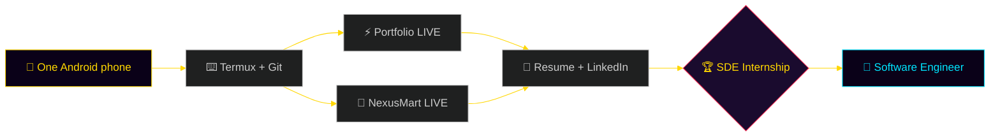

<div align="center">

<!-- ═══════════════════════════════════════════════════════════ -->
<!--            THE A→Z CODEX · 26 CHAPTERS · ONE LEGEND          -->
<!--     Hand-built on an Android phone. Every pixel is earned.   -->
<!-- ═══════════════════════════════════════════════════════════ -->


&nbsp;
<a href="https://github.com/Manashjyoti-Bora?tab=followers"></a>


## 📖 TABLE OF 26 CHAPTERS

| | | | |
|:---:|:---:|:---:|:---:|
| [Ａ · ARRIVAL](#-ａ--arrival) | [Ｂ · BOOT](#-ｂ--boot-sequence) | [Ｃ · CHARACTER](#-ｃ--character-sheet) | [Ｄ · DEPLOYS](#-ｄ--deployments) |
| [Ｅ · EVOLUTION](#-ｅ--evolution-3d-city) | [Ｆ · FIRE](#-ｆ--fire-streak) | [Ｇ · GRAPH](#-ｇ--graph-of-grind) | [Ｈ · HEATMAP](#-ｈ--heatmap-of-gold) |
| [Ｉ · INVENTORY](#-ｉ--inventory) | [Ｊ · JOURNEY](#-ｊ--journey-map) | [Ｋ · KEYBOARD](#-ｋ--keyboard-warrior) | [Ｌ · LANGUAGES](#-ｌ--languages) |
| [Ｍ · METRICS](#-ｍ--metrics) | [Ｎ · NEXUSMART](#-ｎ--nexusmart) | [Ｏ · ORIGIN](#-ｏ--origin-story) | [Ｐ · PORTFOLIO](#-ｐ--portfolio) |
| [Ｑ · QUOTE](#-ｑ--quote-of-the-run) | [Ｒ · RESUME](#-ｒ--resume) | [Ｓ · SNAKE](#-ｓ--snake-eats-my-commits) | [Ｔ · TIMEZONE](#-ｔ--timezone-stats) |
| [Ｕ · UNFAIR](#-ｕ--unfair-advantage) | [Ｖ · VAULT](#-ｖ--vault-of-repos) | [Ｗ · WORKSTATION](#-ｗ--workstation) | [Ｘ · XP BARS](#-ｘ--xp-bars) |
| [Ｙ · YEAR GOALS](#-ｙ--year-2026-quests) | [Ｚ · ZERO TO...](#-ｚ--zero-to-legend) | | |

</div>

<br/>


# 🏛️ Ａ · ARRIVAL

<div align="center">


**A new challenger has entered the arena.**
No laptop. No excuses. One Android phone, Termux, and an internet connection —
that is the entire origin equipment of everything you are about to scroll through.

</div>


# 🖥️ Ｂ · BOOT SEQUENCE

```ansi
 ██████╗  ██████╗ ██████╗  ███████╗██╗  ██╗
██╔════╝ ██╔═══██╗██╔══██╗ ██╔════╝╚██╗██╔╝
██║      ██║   ██║██║  ██║ █████╗   ╚███╔╝ 
██║      ██║   ██║██║  ██║ ██╔══╝   ██╔██╗ 
╚██████╗ ╚██████╔╝██████╔╝ ███████╗██╔╝ ██╗
 ╚═════╝  ╚═════╝ ╚═════╝  ╚══════╝╚═╝  ╚═╝

[  OK  ] Mounting /dev/ambition ............... DONE
[  OK  ] Loading driver: termux-arm64 ......... DONE
[  OK  ] Detecting laptop ..................... NOT FOUND (ignored)
[  OK  ] Starting service: daily-commit.d ..... ACTIVE
[  OK  ] Deploying to production .............. 2 APPS LIVE
[ BOOT ] Welcome, Manashjyoti Bora. God mode is ∞ ENABLED.
```


# 🎴 Ｃ · CHARACTER SHEET


```yaml
# ═══ PLAYER FILE · RARITY: ONE OF A KIND ═══
name        : Manashjyoti Bora
class       : Full Stack Developer
level       : B.Voc IT · Year 1 · Dr. B.K.B. College
spawn_point : Nagaon, Assam, India 🇮🇳
weapon      : Android phone + Termux (no laptop)
stack       : Next.js · React · TypeScript · MongoDB
deploys     : 2 products LIVE in production
languages   : Assamese · English · Hindi
quest       : SDE Internship [LEGENDARY DROP]
special     : ships from a phone faster than
              most people ship from a desk
```

<br clear="right"/>

<div align="center">

⚔️ **STR: Shipping** &nbsp;·&nbsp; 🧠 **INT: Debugging** &nbsp;·&nbsp; 🔥 **STA: Consistency** &nbsp;·&nbsp; 💎 **LUK: Not needed**

</div>


# 🚀 Ｄ · DEPLOYMENTS

<div align="center">


**Two real products. Live on the internet. Right now. Click them.**

| 🛰️ PRODUCT | 💡 WHAT IT IS | 🌐 STATUS |
|:---|:---|:---:|
| **⚡ AUREA Portfolio** | Next.js 14 · 3D particle hero · AI chatbot · hidden terminal · ⌘K palette | [](https://manashjyoti-bora.vercel.app) |
| **🛒 NexusMart** | Full-stack e-commerce · JWT auth · MongoDB · admin panel · cart → checkout | [](https://nexusmart-dusky.vercel.app) |

</div>


# 🌆 Ｅ · EVOLUTION (3D CITY)

<div align="center">

**My commits build a literal 3D city. Every green square becomes a skyscraper.**


</div>


# 🔥 Ｆ · FIRE STREAK

<div align="center">


**Rule of the Codex:** the streak may bend, but the grind never breaks.

</div>


# 📈 Ｇ · GRAPH OF GRIND

<div align="center">


</div>


# 🟨 Ｈ · HEATMAP OF GOLD

<div align="center">

**Same contribution data — recolored in pure gold. Because green is for everyone else.**


</div>


# 🎒 Ｉ · INVENTORY

<div align="center">


### ⚔️ Equipped (animated relics)

&nbsp;
&nbsp;
&nbsp;
&nbsp;


### 🧰 Full loadout


<br/>


</div>


# 🗺️ Ｊ · JOURNEY MAP



> 🧭 This map is drawn in **Mermaid** — GitHub renders it natively. The route is one-way: forward only.


# ⌨️ Ｋ · KEYBOARD WARRIOR

<div align="center">


**Fun fact:** this "keyboard" is a 6-inch touchscreen. Respect the thumbs. 👍👍

</div>


# 🈯 Ｌ · LANGUAGES

<div align="center">


**Human languages:** Assamese (native) · English (professional) · Hindi
**Machine languages:** TypeScript · JavaScript · HTML · CSS · YAML that actually works

</div>


# 📊 Ｍ · METRICS

<div align="center">


&nbsp;


</div>


# 🛒 Ｎ · NEXUSMART

<div align="center">

**Boss fight #2 — a full e-commerce platform, defeated solo.**

</div>

```text
┌─ NEXUSMART · FULL-STACK E-COMMERCE ─────────────────────────┐
│  🔐 Auth ........ JWT (HTTP-only cookies) + bcrypt hashing  │
│  🗄️ Database .... MongoDB Atlas + Mongoose models           │
│  🛡️ Validation .. Zod on every API route                    │
│  👑 Admin ....... role-gated dashboard (403 for mortals)    │
│  🛍️ Features .... products · cart · checkout · orders       │
│  📱 Built on .... an Android phone. Yes, really.            │
└─────────────────────────────────────────────────────────────┘
```

<div align="center">

[](https://nexusmart-dusky.vercel.app)&nbsp;
[](https://github.com/Manashjyoti-Bora/nexusmart)

</div>


# 🌱 Ｏ · ORIGIN STORY


> Most devs start with a laptop.
> I started with a **phone** and a question:
> *"How far can I go with just this?"*
>
> The answer so far:
> ✅ 2 production apps live on the internet
> ✅ CI/CD pipelines building 3D cities from commits
> ✅ A resume, a portfolio, and this Codex —
> &nbsp;&nbsp;&nbsp;&nbsp; all typed with two thumbs.
>
> **The next chapter is written by whoever hires me.** 😉

<br clear="right"/>


# ⚡ Ｐ · PORTFOLIO

<div align="center">

**Boss fight #1 — AUREA, a portfolio that fights back.**

</div>

```text
┌─ AUREA · INTERACTIVE PORTFOLIO ─────────────────────────────┐
│  🌌 3D particle hero ....... Three.js + React Three Fiber   │
│  🤖 AI chatbot ............. ask it anything about me       │
│  ⌨️ Command palette ........ press Ctrl+K like a pro        │
│  🕹️ Hidden terminal ........ Ctrl+/ … try `sudo hire-me`    │
│  🎮 Easter eggs ............ Konami code · `iddqd` · more   │
│  📊 Live GitHub dashboard .. real API, zero fake numbers    │
└─────────────────────────────────────────────────────────────┘
```

<div align="center">

[](https://manashjyoti-bora.vercel.app)&nbsp;
[](https://github.com/Manashjyoti-Bora/portfolio-website)

</div>


# 💬 Ｑ · QUOTE OF THE RUN

<div align="center">


*(New wisdom drops on every refresh — free DLC.)*

</div>


# 📜 Ｒ · RESUME

<div align="center">


**One PDF. Zero fluff. All proof.**

[](https://manashjyoti-bora.vercel.app/resume.pdf)&nbsp;
[](https://www.linkedin.com/in/manashjyoti-bora-323b97405)&nbsp;
[](mailto:manashjyotibora122@gmail.com)

</div>


# 🐍 Ｓ · SNAKE EATS MY COMMITS

<div align="center">


**Every night at 00:00 UTC, a robot snake is dispatched to devour my contribution graph.**


</div>


# 🕐 Ｔ · TIMEZONE STATS

<div align="center">

**When does the grind happen? (IST · UTC+5:30 · Nagaon, Assam)**


</div>


# 🃏 Ｕ · UNFAIR ADVANTAGE

```ansi
╔══════════════════════════════════════════════════════════╗
║  WHY BET ON THE PHONE GUY?                                ║
╠══════════════════════════════════════════════════════════╣
║  Everyone else needs perfect conditions to start.        ║
║  I shipped production apps with ZERO perfect conditions.║
║                                                          ║
║  Give me a laptop and a team, and watch what happens     ║
║  when the constraints are finally removed.               ║
╚══════════════════════════════════════════════════════════╝
```


# 🗄️ Ｖ · VAULT OF REPOS

<div align="center">

| 🏦 VAULT ITEM | 🏷️ TYPE | 🔗 OPEN |
|:---|:---|:---:|
| **portfolio-website** | Next.js 14 · 3D · AI chatbot | [🔓 Unlock](https://github.com/Manashjyoti-Bora/portfolio-website) |
| **nexusmart** | Full-stack e-commerce | [🔓 Unlock](https://github.com/Manashjyoti-Bora/nexusmart) |
| **devhire-pro-ats** | ATS resume screening UI | [🔓 Unlock](https://github.com/Manashjyoti-Bora/devhire-pro-ats) |
| **taskflow-enterprise** | Enterprise task manager | [🔓 Unlock](https://github.com/Manashjyoti-Bora/taskflow-enterprise) |
| **Manashjyoti-Bora** | This Codex you are reading | [🔓 Unlock](https://github.com/Manashjyoti-Bora/Manashjyoti-Bora) |

</div>


# 🛠️ Ｗ · WORKSTATION

<div align="center">


| 🧩 SLOT | ⚙️ EQUIPPED GEAR |
|:---|:---|
| 💻 Machine | Android phone (the whole datacenter) |
| 🐧 Terminal | Termux · Node.js · Git |
| ☁️ Build farm | Vercel (cloud does the heavy lifting) |
| 🗄️ Database | MongoDB Atlas |
| 🚦 CI/CD | GitHub Actions (snake · 3D city · more) |
| 🧠 IDE | GitHub web editor + pure patience |

</div>


# 📶 Ｘ · XP BARS

```text
FRONTEND  ██████████████████░░░░░░░  React · Next.js · Tailwind
BACKEND   ████████████████░░░░░░░░░  Node · Express · REST APIs
DATABASE  ██████████████░░░░░░░░░░░  MongoDB · Mongoose · Atlas
TYPESCRIPT████████████████░░░░░░░░░  strict mode, no `any` army
DEVOPS    ████████████░░░░░░░░░░░░░  Vercel · GitHub Actions
HYPE      █████████████████████████  MAX (permanent buff)
```

> 📈 Bars refill daily via commits. No pay-to-win. Grind only.


# 🎯 Ｙ · YEAR 2026 QUESTS

- [x] ⚡ **Deploy portfolio to production** — DONE
- [x] 🛒 **Ship full-stack e-commerce with real auth + DB** — DONE
- [x] 🏙️ **Automate a 3D city from my commits** — DONE
- [x] 💼 **LinkedIn launch + real network building** — DONE
- [ ] 🌍 **First open-source PR to someone else's repo** — IN PROGRESS
- [ ] 📦 **Publish first npm package** — QUEUED
- [ ] 🏆 **FINAL BOSS: land SDE internship** — TARGET LOCKED


# 🌅 Ｚ · ZERO TO LEGEND

<div align="center">


<br/><br/>


### You just read all 26 chapters. That makes you part of the story now.

**The Codex updates itself every day I commit — which is every day.**

[](https://manashjyoti-bora.vercel.app)&nbsp;
[](https://www.linkedin.com/in/manashjyoti-bora-323b97405)&nbsp;
[](mailto:manashjyotibora122@gmail.com)

<br/>

*"Zero laptops were used in the making of this legend."* 📱⚡


<!-- 🥚 SECRET CHAPTER 27: if you found this comment, email me the word "CODEX" and I owe you a coffee (virtual, I'm a student). -->

</div>
