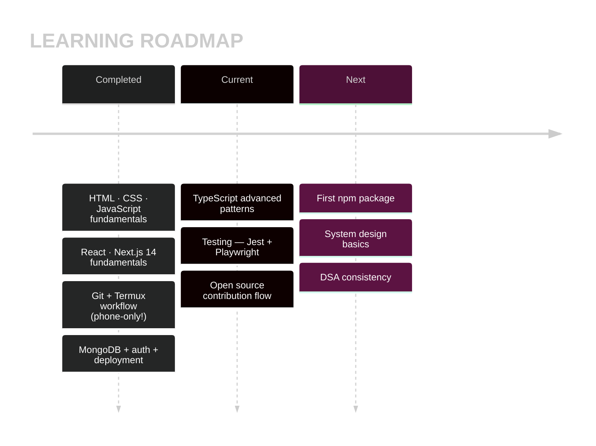
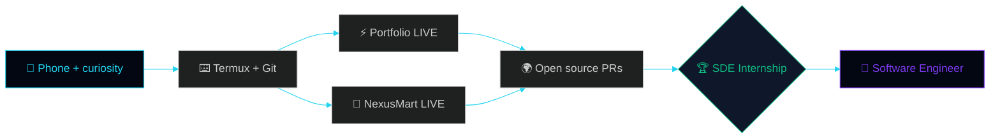

<div align="center">

<!-- ════════════════════════════════════════════════════════════════ -->
<!--  Manashjyoti Bora · Full-Stack Development Student                 -->
<!--  Portfolio of work built and deployed entirely from a mobile       -->
<!--  device. All animations are hand-coded SVG (SMIL).                 -->
<!-- ════════════════════════════════════════════════════════════════ -->

<!-- ═══ CUSTOM HERO — hand-coded SVG · theme-aware dark/light ═══ -->
<picture>
  <source media="(prefers-color-scheme: dark)" srcset="https://raw.githubusercontent.com/Manashjyoti-Bora/Manashjyoti-Bora/main/assets/hero-dark.svg">
  <source media="(prefers-color-scheme: light)" srcset="https://raw.githubusercontent.com/Manashjyoti-Bora/Manashjyoti-Bora/main/assets/hero-light.svg">
  
</picture>

<sub>Hand-coded SVG banner — adapts to your GitHub light/dark theme.</sub>


&nbsp;
<a href="https://github.com/Manashjyoti-Bora?tab=followers"></a>&nbsp;


[](https://manashjyoti-bora.vercel.app)&nbsp;
[](https://www.linkedin.com/in/manashjyoti-bora-323b97405)&nbsp;
[](mailto:manashjyotibora122@gmail.com)&nbsp;
[](https://manashjyoti-bora.vercel.app/resume.pdf)

<!-- Live uptime — real monitors -->
&nbsp;


</div>

> [!IMPORTANT]
> **Summary:** First-year IT student, learning full-stack development in public. While studying, I have **designed, built, and deployed two production applications** — using only an Android phone as my development machine. Every claim on this page links to live, verifiable work.

<!-- ═══ CUSTOM FX 1: HAND-CODED MATRIX RAIN DIVIDER ═══ -->


# 📖 01 · Background — Why a Phone?


> I'm a first-year B.Voc IT student from Nagaon, Assam.
> I don't own a laptop — so I built my entire development
> environment on an Android phone:
>
> - ⌨️ **Termux** — terminal, Git, Node.js
> - 🌐 **GitHub web editor** — code editing
> - ☁️ **Vercel** — cloud builds and deployment
>
> My approach: learn a concept, then immediately apply it
> to a real project. As a result, my repositories aren't
> tutorial copies — **they are live, deployed products.**

<br clear="right"/>

```ansi
[ DAY 001 ] First "Hello World" executed .............. day one
[ DAY 0XX ] First git push from Termux ................ milestone one
[ DAY 0XX ] First production deploy on Vercel ......... portfolio live
[ DAY 0XX ] Second app shipped with a real database ... full-stack unlocked
[ TODAY   ] Still learning. Still shipping. ........... in progress
```


# 🗂️ 02 · Projects — What Each One Taught Me

<div align="center">


**Each repository represents a stage of learning. All demos are live:**

</div>

## ⚡ portfolio-website — Frontend Engineering

```text
┌─ OVERVIEW ──────────────────────────────────────────────────┐
│  AUREA — interactive developer portfolio                    │
│  🌌 3D particle hero (Three.js + React Three Fiber)         │
│  🤖 AI chatbot with intent matching                         │
│  ⌨️ Ctrl+K command palette · Ctrl+/ hidden terminal         │
│  📊 Live GitHub dashboard (real API, zero fake numbers)     │
├─ SKILLS APPLIED ────────────────────────────────────────────┤
│  Next.js 14 App Router · TypeScript · Tailwind · GSAP       │
│  Framer Motion · API routes · SEO · security headers        │
└─────────────────────────────────────────────────────────────┘
```

[](https://manashjyoti-bora.vercel.app) [](https://github.com/Manashjyoti-Bora/portfolio-website)

## 🛒 nexusmart — Backend, Database & Security

```text
┌─ OVERVIEW ──────────────────────────────────────────────────┐
│  Full-stack e-commerce: auth, cart, checkout, orders        │
│  🔐 JWT auth (HTTP-only cookies) + bcrypt password hashing  │
│  🗄️ MongoDB Atlas with persistent order storage             │
│  👑 Role-based admin dashboard                              │
├─ SKILLS APPLIED ────────────────────────────────────────────┤
│  Mongoose models · Zod validation · REST API design         │
│  auth flows · environment secrets · production debugging    │
└─────────────────────────────────────────────────────────────┘
```

[](https://nexusmart-dusky.vercel.app) [](https://github.com/Manashjyoti-Bora/nexusmart)

## 🧪 devhire-pro-ats & taskflow-enterprise — UI Patterns & State

| REPOSITORY | FOCUS AREA | LINK |
|:---|:---|:---:|
| **devhire-pro-ats** | ATS-style screening UI, complex layouts | [Open](https://github.com/Manashjyoti-Bora/devhire-pro-ats) |
| **taskflow-enterprise** | Task management, state handling, CRUD | [Open](https://github.com/Manashjyoti-Bora/taskflow-enterprise) |

## 🤖 Manashjyoti-Bora (this repository) — CI/CD & Automation

This profile is itself a project: **three GitHub Actions pipelines** (contribution snake, 3D city, automated rebuilds) that I configured and debugged independently, plus **six hand-coded SMIL animation files** rendered on this page.

<!-- ═══ CUSTOM FX 3: FX LAB — 30 techniques in one hand-coded file ═══ -->


# 🧪 03 · The FX Lab — Hand-Coded SVG Animation Study

<div align="center">

**A self-directed study in SVG animation. These files are not decorations pulled from a library — every element on this page (hero banner, matrix divider, metrics dashboard, and the two panels below) is written by hand in declarative SVG.**


*Built as a deliberate practice exercise — the fastest way to learn a technique is to implement it thirty times.*

**A second set of 24 techniques, including SVG-simulated versions of effects that normally require JavaScript (cursor trails, hover interactions):**


*54 hand-coded panels in total. GitHub does not execute JavaScript in READMEs, so interactive effects were reproduced frame-by-frame in declarative SVG.*

</div>

# 📚 04 · Current Learning

<div align="center"></div>



**Self-assessment:**

```text
HTML/CSS     ██████████████████░░░░░░░  foundation
JAVASCRIPT   ████████████████░░░░░░░░░  applied in production
REACT/NEXT   ██████████████████░░░░░░░  two deployed apps
TYPESCRIPT   ██████████████░░░░░░░░░░░  strict mode, no any
BACKEND/DB   ██████████████░░░░░░░░░░░  JWT auth, MongoDB
TESTING      ██████░░░░░░░░░░░░░░░░░░░  actively learning
CONSISTENCY  █████████████████████████  daily commits
```


# 🛠️ 05 · Development Environment

<div align="center">


### Core stack

&nbsp;
&nbsp;
&nbsp;
&nbsp;


<br/>


| COMPONENT | TOOL |
|:---|:---|
| 💻 Machine | Android phone |
| 🐧 Terminal | Termux — Node.js, Git, npm |
| ✏️ Editor | GitHub web editor |
| ☁️ Build & deploy | Vercel |
| 🗄️ Database | MongoDB Atlas |
| 🚦 CI/CD | GitHub Actions |

</div>


# 📊 06 · Live Metrics


<div align="center">


**All widgets below pull live data:**


**Contribution activity rendered as a 3D city — rebuilt nightly by GitHub Actions:**


**Contribution snake — regenerated daily at 00:00 UTC:**


**Contribution heatmap:**


</div>


# 🧭 07 · Roadmap



- [x] First line of code — written on a phone
- [x] First production deployment
- [x] First full-stack application with a live database
- [x] First CI/CD pipelines
- [x] First hand-coded SMIL animation files (this page)
- [ ] First external open-source contribution — **in progress**
- [ ] First published npm package
- [ ] SDE internship — **primary objective**


# 📬 08 · Contact

<div align="center">


**Open to SDE internship opportunities — remote-ready, IST timezone, immediate availability.**

[](mailto:manashjyotibora122@gmail.com?subject=Hello%20Manashjyoti)&nbsp;
[](https://www.linkedin.com/in/manashjyoti-bora-323b97405)

**Animated 3D social icons (tap them — they spin!):**

<a href="https://www.linkedin.com/in/manashjyoti-bora-323b97405"></a>&nbsp;&nbsp;
<a href="mailto:manashjyotibora122@gmail.com"></a>&nbsp;&nbsp;
<a href="https://github.com/Manashjyoti-Bora"></a>


<details>
<summary>💡 <b>A closing note (tap to open)</b></summary>
<br/>

```ansi
╔════════════════════════════════════════════════╗
║   THE REAL LESSON 🌱                           ║
║                                                ║
║   Hardware doesn't make a developer.           ║
║   Consistency does.                            ║
║                                                ║
║   If all you have is a phone — start with      ║
║   the phone. Starting is the real skill.      ║
╚════════════════════════════════════════════════╝
```

</details>

<br/>

<samp>Updated continuously — one commit at a time.</samp><br/>
<sub>© 2026 Manashjyoti Bora · Nagaon, Assam, India</sub>


</div>
