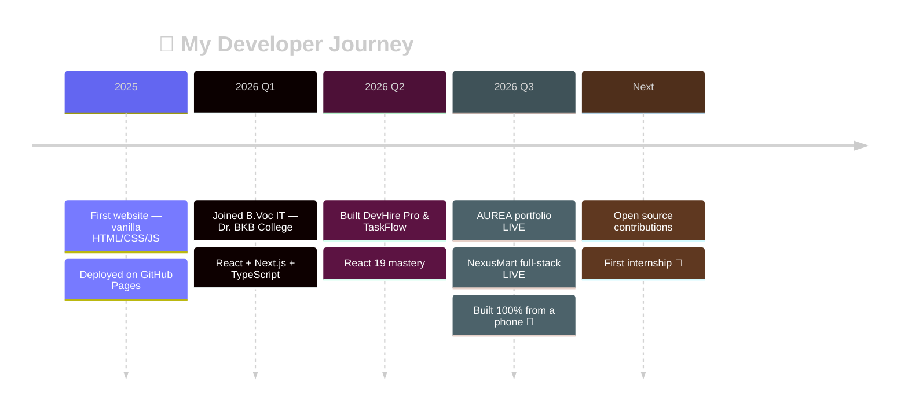

<div align="center">

<!-- ═══════════════════ HERO BANNER ═══════════════════ -->


<!-- ═══════════════════ TYPING ANIMATION ═══════════════════ -->

[](https://manashjyoti-bora.vercel.app)


<!-- ═══════════════════ STATUS BADGES ═══════════════════ -->


[](https://github.com/Manashjyoti-Bora?tab=followers)


[](https://manashjyoti-bora.vercel.app)
[](mailto:manashjyotibora122@gmail.com)
[](https://www.linkedin.com/in/manashjyoti-bora-323b97405)


</div>


<!-- ═══════════════════ INTRODUCTION ═══════════════════ -->

## 👨‍💻 Professional Introduction

<table>
<tr>
<td width="62%" valign="top">

I'm a **Full Stack Software Developer** from **Nagaon, Assam, India** 🇮🇳 who builds end-to-end web applications — from Figma-level UI polish to typed APIs and cloud deployment.

**What I build:** Production-grade web apps with React 19, Next.js App Router, TypeScript and Node.js — dashboards, job portals, e-commerce platforms, and award-style portfolios. Every project is **deployed, documented and public**.

**Current focus:** Full-stack system design, Node.js backends, and web performance optimization.

**Career objective:** A Software Developer **internship or junior role** where I can ship real features, learn from senior engineers, and grow into a product-minded full-stack engineer.

**Why hire me:**
- 🚢 I ship complete products, not half-finished tutorials — 4+ live deployments
- 🧠 Modern stack fluency: React 19, Next.js 14+, TypeScript, Tailwind, Node.js
- 📱 Resourceful by nature — I engineered & deployed my entire portfolio **from an Android phone** using Termux, Git and Vercel
- 🔍 100% of my code is public — my GitHub *is* my resume

**Values:** Clean code · Ship real things · Learn in public · Mobile-first always

**Fun fact:** My dev machine for this profile's portfolio was a phone. No laptop, no excuses. 😄

</td>
<td width="38%" valign="top">


<br/><br/>

```ansi
❯ whoami
Manashjyoti Bora — Full Stack Developer
❯ status
● AVAILABLE for internships & junior roles
❯ superpower
Ships production code from a phone 📱
```

```yaml
name: Manashjyoti Bora
role: Full Stack Developer
education: B.Voc Information Technology
location: Nagaon, Assam, India (IST)
languages: [English, Assamese, Hindi]
open_to: [Internship, Junior Roles]
remote: Ready ✅
```

</td>
</tr>
</table>


<!-- ═══════════════════ ABOUT ME ═══════════════════ -->

##  About Me

| | |
|---|---|
| 🎓 **Education** | B.Voc in Information Technology — Nagaon, Assam *(ongoing)* |
| 🌱 **Currently Learning** | Full-Stack System Design · Microservices · Web Performance |
| 💼 **Experience** | Self-driven developer — 4+ production apps designed, built & deployed solo |
| ⚡ **Strengths** | Fast learner · UI/UX instinct · End-to-end ownership · Consistency |
| 🎨 **Interests** | Creative frontend · Motion design · Developer tooling · Open source |
| 🗺️ **Roadmap** | Internship → Junior Developer → Product-minded Full-Stack Engineer |


<!-- ═══════════════════ TECH STACK ═══════════════════ -->

##  Tech Stack & Tools

<div align="center">


*↑ these icons are animated — watch them move!*

</div>

### ⚡ Frontend & Styling


### ⚙️ Backend, APIs & Databases


### ☁️ Cloud, DevOps & Deployment


### 🔧 Workflow, Build & Design Tools


### 🎨 Skill Meters

| | | |
|---|---|---|
| **React / Next.js** | 🟪🟪🟪🟪🟪🟪🟪🟪⬜⬜ | `expert-track` |
| **TypeScript** | 🟦🟦🟦🟦🟦🟦🟦🟦⬜⬜ | `daily driver` |
| **Tailwind CSS** | 🟩🟩🟩🟩🟩🟩🟩🟩🟩⬜ | `fluent` |
| **Node.js / APIs** | 🟨🟨🟨🟨🟨🟨🟨⬜⬜⬜ | `shipping` |
| **MongoDB** | 🟧🟧🟧🟧🟧🟧🟧⬜⬜⬜ | `production-used` |
| **Consistency** | 🟥🟥🟥🟥🟥🟥🟥🟥🟥🟥 | `superpower` 🔥 |

<details>
<summary><b>📋 Full stack breakdown (click to expand)</b></summary>
<br/>

| Category | Technologies |
|---|---|
| **Frontend** | React 19, Next.js 14+ (App Router), TypeScript, JavaScript ES6+ |
| **Styling** | Tailwind CSS, CSS3, Bootstrap, shadcn/ui, Responsive / Mobile-first |
| **State Management** | Redux, React Hooks & Context |
| **Backend & APIs** | Node.js, Express.js, REST APIs |
| **Database & Auth** | MongoDB, Firebase, Supabase |
| **DevOps & CI/CD** | Git, GitHub, GitHub Actions, Vercel auto-deployments |
| **Deployment** | Vercel, Netlify, GitHub Pages |
| **Testing & Debug** | Postman, Chrome DevTools, Lighthouse |
| **AI Tools** | AI-assisted development, prompt engineering |
| **Design** | Figma, UI animation (GSAP, Framer Motion, Three.js) |
| **Build & Package** | Vite, npm, Next.js build pipeline |
| **Environment** | Linux (Termux), VS Code |

</details>


<!-- ═══════════════════ FEATURED PROJECTS ═══════════════════ -->

##  Featured Projects

<table>
<tr>
<td width="50%" valign="top">

### 🌐 AUREA — Portfolio Website
**⭐ Best & Latest Project** · `v1.0` · ✅ Live in Production

[](https://manashjyoti-bora.vercel.app)
[](https://github.com/Manashjyoti-Bora/portfolio-website)

> Award-style premium developer portfolio — a full product, not a template.

**Key Features:**
- ✨ Three.js 3D particle hero + GSAP scroll choreography
- ⌨️ ⌘K command palette, hidden terminal & easter eggs
- 🤖 AI concierge chatbot + live GitHub dashboard
- 🌗 Dark/Light themes with 5 accent palettes
- 🔒 CSP/HSTS security headers, JSON-LD SEO, dynamic OG images
- ♿ Accessibility-first: reduced-motion support, keyboard nav

`Next.js 14` `TypeScript` `Tailwind` `GSAP` `Framer Motion` `Three.js`

</td>
<td width="50%" valign="top">

### 💼 DevHire Pro — Job Portal & ATS
**🧩 Most Complex Logic** · `v1.0` · ✅ Complete

[](https://github.com/Manashjyoti-Bora/devhire-pro-ats)

> Enterprise-grade applicant tracking system for tech recruitment.

**Key Features:**
- 🔍 Real-time multi-attribute filtering (keyword + skill + location)
- 📊 Interactive application pipeline tracker
- 🌓 Glassmorphic light/dark theme switching
- ⚡ Memoized rendering — zero lag while filtering

`React 19` `Vite` `JavaScript` `Lucide Icons` `Modern CSS`

</td>
</tr>
<tr>
<td width="50%" valign="top">

### 🛒 NexusMart — Full-Stack E-Commerce
**⚙️ Backend Powerhouse** · `v1.0` · ✅ Live in Production

[](https://nexusmart-dusky.vercel.app)
[](https://github.com/Manashjyoti-Bora/nexusmart)

> Complete online store proving the full stack: real database, real auth, real checkout — try it live.

**Key Features:**
- 🔐 JWT auth — bcrypt hashing, HTTP-only cookies, rate-limited login
- 🗄️ MongoDB Atlas — users, products & orders (server-computed totals)
- 🛒 Cart with optimistic updates, checkout & order history
- 🛠️ Role-gated admin panel with product CRUD
- ✅ Zod validation on client AND server

`Next.js` `TypeScript` `Node.js` `MongoDB` `JWT` `Zod` `Tailwind`

</td>
<td width="50%" valign="top">

### 📋 TaskFlow — Agile Kanban Suite
**🎯 Cleanest State Design** · `v1.0` · ✅ Complete

[](https://github.com/Manashjyoti-Bora/taskflow-enterprise)

> Agile productivity suite with dynamic Kanban boards and sprint tracking.

**Key Features:**
- 📌 Dynamic stage columns: To Do → In Progress → Done
- 🏷️ Live priority tagging (High / Medium / Low)
- 🔄 Centralized state — every view syncs instantly
- 🎨 Professional dark-themed dashboard

`React` `JavaScript ES6+` `State Management` `CSS`

</td>
</tr>
</table>

<div align="center">

**➕ The journey:** Started with hand-coded vanilla HTML/CSS/JS in 2025 → shipping typed Next.js products in 2026. Proof of fundamentals 💪

</div>


<!-- ═══════════════════ GITHUB ANALYTICS ═══════════════════ -->

##  GitHub Analytics

<div align="center">


### 🏙️ 3D Contribution City (yes, THREE-DIMENSIONAL!)


### 🐍 Contribution Snake


### 🗓️ Contribution Heatmap


</div>


<!-- ═══════════════════ OPEN SOURCE + LEARNING ═══════════════════ -->

##  Open Source & Current Learning

<table>
<tr>
<td width="50%" valign="top">

### 🔓 Open Source
- 💯 **100% of my project code is public** — every repo open, documented and clickable
- 🧹 Professional Git hygiene: meaningful commits, clean history, README-first repos
- 🎯 **Goal:** first external open-source contributions in 2026 — starting with docs and good-first-issues in the React/Next.js ecosystem

</td>
<td width="50%" valign="top">


### 📚 Learning Roadmap
- ✅ HTML/CSS/JS fundamentals → React → Next.js + TypeScript *(done, shipped)*
- 🔄 **Now:** Node.js backends, system design, performance optimization
- 🎯 **Next:** Testing (Jest/Playwright), Docker basics, PostgreSQL
- 🏁 **Goal:** Production-ready full-stack engineer

</td>
</tr>
</table>



##  Milestones & Achievements

| Year | Achievement |
|---|---|
| 🚀 2026 | Launched **AUREA** — full Next.js 14 + TypeScript + GSAP portfolio, engineered **entirely from an Android phone** (Termux + Git + Vercel) |
| 🛒 2026 | Shipped **NexusMart** — full-stack e-commerce LIVE: Node.js APIs, MongoDB Atlas, JWT auth, admin panel |
| 💼 2026 | Built **DevHire Pro ATS** & **TaskFlow** with React 19 |
| 🌐 2025 | First deployed website — hand-coded vanilla HTML/CSS/JS on GitHub Pages |


<!-- ═══════════════════ PHILOSOPHY + SERVICES ═══════════════════ -->

##  Development Philosophy

<div align="center">

| 🧹 Clean Code | 🏗️ Scalable Architecture | ⚡ Performance First | ♿ Accessibility |
|:---:|:---:|:---:|:---:|
| *Self-documenting, modular — if a teammate can't read it, it isn't done* | *Data modeled before UI; components composed, never duplicated* | *Animate transforms only, measure with Lighthouse, mobile-first* | *Keyboard nav, reduced-motion, semantic HTML — by default* |

| 📱 Responsive Design | 🎨 User Experience | 📖 Continuous Learning | ✅ Best Practices |
|:---:|:---:|:---:|:---:|
| *Every layout starts at 360px — most of India browses on phones* | *Loading, empty & error states designed first* | *Ship something new every week, learn in public* | *Typed code, meaningful commits, deployed proof* |

</div>

##  What I Can Do For You

`Frontend Development` · `Full Stack Development` · `Responsive Websites` · `UI Implementation (Figma → Code)` · `API Integration` · `Performance Optimization`


<!-- ═══════════════════ RECRUITER SECTION ═══════════════════ -->


##  For Recruiters — Quick Facts

> [!IMPORTANT]
> **⚡ TL;DR for busy recruiters:** 1st-year student · 2 live products · 100% public code · immediately available · replies within 24h.

> [!TIP]
> **Fastest way to evaluate me:** open [nexusmart-dusky.vercel.app](https://nexusmart-dusky.vercel.app), create an account, place an order. That's a real MongoDB + JWT backend you just used — built from a phone.


<div align="center">

| | |
|---|---|
| 💼 **Seeking** | Software Developer / Full-Stack / Frontend **Internship & Junior Roles** |
| ⏰ **Availability** | **Immediately available** |
| 🌍 **Work Mode** | Remote-ready ✅ · Hybrid · On-site (Assam/India) |
| 🕐 **Time Zone** | IST (UTC+5:30) — flexible overlap with global teams |
| 🤝 **Collaboration** | Git/GitHub workflow, code reviews, agile-friendly |
| ⚡ **Response Time** | Within 24 hours, every time |

[](https://manashjyoti-bora.vercel.app/resume.pdf)
[](https://manashjyoti-bora.vercel.app/resume.pdf)

### 🌐 Portfolio — My Work, Live

[](https://manashjyoti-bora.vercel.app)
[](https://github.com/Manashjyoti-Bora/portfolio-website)

</div>


<!-- ═══════════════════ CONTACT ═══════════════════ -->

##  Let's Connect

<div align="center">

<a href="https://www.linkedin.com/in/manashjyoti-bora-323b97405"></a>
&nbsp;
<a href="mailto:manashjyotibora122@gmail.com"></a>
&nbsp;
<a href="https://manashjyoti-bora.vercel.app"></a>

[](mailto:manashjyotibora122@gmail.com)
[](https://www.linkedin.com/in/manashjyoti-bora-323b97405)
[](https://github.com/Manashjyoti-Bora)
[](https://manashjyoti-bora.vercel.app)

<!-- ═══════════════════ FUN + QUOTE ═══════════════════ -->

### ✨ Daily Dev Wisdom


### ⌨️ Try My Portfolio's Secret Shortcuts

Visit [manashjyoti-bora.vercel.app](https://manashjyoti-bora.vercel.app) and press:

<kbd>Ctrl</kbd> + <kbd>K</kbd> → Command Palette · <kbd>Ctrl</kbd> + <kbd>/</kbd> → Hidden Terminal · type <kbd>i</kbd><kbd>d</kbd><kbd>d</kbd><kbd>q</kbd><kbd>d</kbd> → 🤫 · <kbd>↑</kbd><kbd>↑</kbd><kbd>↓</kbd><kbd>↓</kbd><kbd>←</kbd><kbd>→</kbd><kbd>←</kbd><kbd>→</kbd><kbd>B</kbd><kbd>A</kbd> → 🎊

### 😄 Random Dev Joke (changes every visit!)


**💭 "Ship real things. Learn in public. Every project deployed, every line on GitHub."**

<br/>

**🙏 Thanks for visiting!** If my work resonates, let's talk — the fastest way is [email](mailto:manashjyotibora122@gmail.com).

<details>
<summary>🥚 <b>psst... click here for a secret</b></summary>
<br>

```text
 ┌─────────────────────────────────────────────┐
 │  You found the easter egg! 🎉               │
 │                                             │
 │  Fun fact: this entire GitHub presence —    │
 │  every repo, every README, every deploy —   │
 │  was built without ever touching a laptop.  │
 │                                             │
 │  If a phone can ship production code,       │
 │  imagine what I'll do with a real machine.  │
 │                                             │
 │  Let's build something → manashjyotibora122 │
 │  @gmail.com                                 │
 └─────────────────────────────────────────────┘
```

*There's another easter egg hidden in my portfolio — try typing `iddqd` at manashjyoti-bora.vercel.app* 👀

</details>

<br>


</div>
