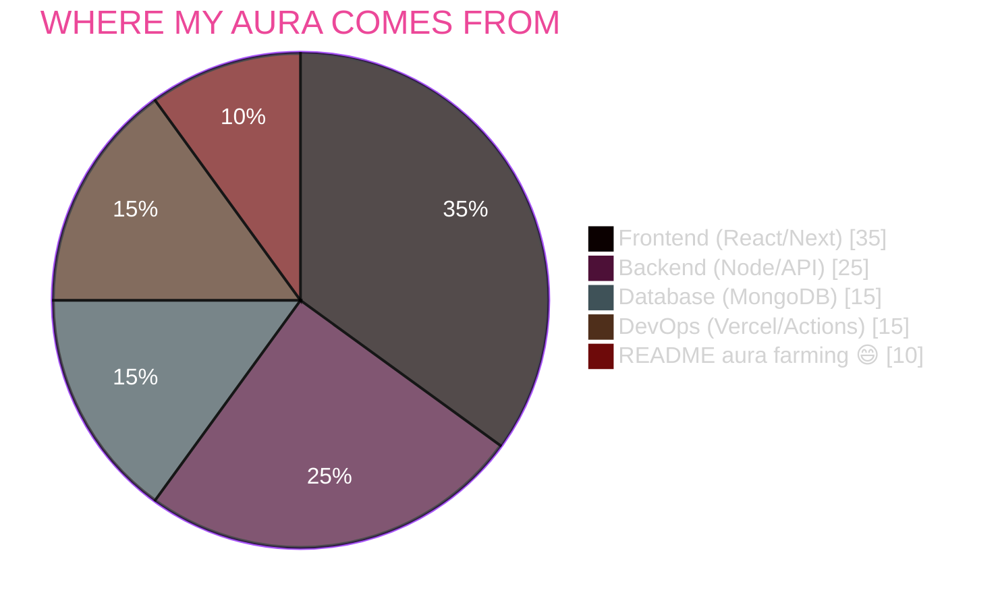
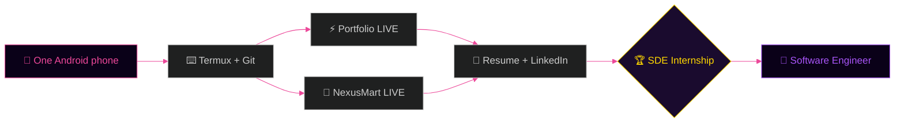
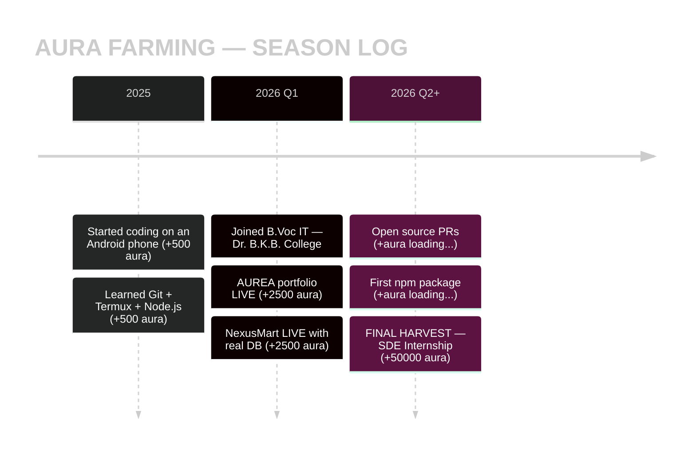

<div align="center">

<!-- ══════════════════════════════════════════════════════════════════ -->
<!--        AURA FARMING ∞ EDITION · CODEX FINAL FORM · MYTHIC 🐐        -->
<!--   Every commit = +100 aura · Zero fumbles · Farmed on a phone       -->
<!--   99.99% of GitHub profiles could NEVER. This one does. Daily.      -->
<!-- ══════════════════════════════════════════════════════════════════ -->


&nbsp;
<a href="https://github.com/Manashjyoti-Bora?tab=followers"></a>&nbsp;


</div>

> [!IMPORTANT]
> **🔮 AURA DISCLOSURE:** This profile farms aura the only legal way — **shipping real products**. Everything below is live, clickable and verifiable. Zero fake widgets. Zero borrowed aura. **All organic. Farm to table.** 🌾

<div align="center">


## 📖 THE AURA LEDGER — 26 CHAPTERS

| | | | |
|:---:|:---:|:---:|:---:|
| [Ａ · AURA CHECK](#-ａ--aura-check) | [Ｂ · BOOT](#-ｂ--boot-sequence) | [Ｃ · CHARACTER](#-ｃ--character-sheet) | [Ｄ · DEPLOYS](#-ｄ--deployments) |
| [Ｅ · EVOLUTION](#-ｅ--evolution-3d-city) | [Ｆ · FIRE](#-ｆ--fire-streak) | [Ｇ · GRAPH](#-ｇ--graph-of-grind) | [Ｈ · HEATMAP](#-ｈ--heatmap-of-aura) |
| [Ｉ · INVENTORY](#-ｉ--inventory) | [Ｊ · JOURNEY](#-ｊ--journey-map) | [Ｋ · KEYBOARD](#-ｋ--keyboard-warrior) | [Ｌ · LANGUAGES](#-ｌ--languages) |
| [Ｍ · METRICS](#-ｍ--metrics) | [Ｎ · NEXUSMART](#-ｎ--nexusmart) | [Ｏ · ORIGIN](#-ｏ--origin-story) | [Ｐ · PORTFOLIO](#-ｐ--portfolio) |
| [Ｑ · QUOTE](#-ｑ--quote-of-the-run) | [Ｒ · RESUME](#-ｒ--resume) | [Ｓ · SNAKE](#-ｓ--snake-eats-my-commits) | [Ｔ · TIMEZONE](#-ｔ--timezone-stats) |
| [Ｕ · UNFAIR](#-ｕ--unfair-advantage) | [Ｖ · VAULT](#-ｖ--vault-of-repos) | [Ｗ · WORKSTATION](#-ｗ--workstation) | [Ｘ · XP BARS](#-ｘ--aura-bars) |
| [Ｙ · YEAR GOALS](#-ｙ--year-2026-harvests) | [Ｚ · ZENITH](#-ｚ--zenith-of-aura) | | |

</div>

<br/>


# 🔮 Ａ · AURA CHECK

<div align="center">


**Aura check passed. Vibe check passed. Code review… also passed.**
No laptop. No excuses. One Android phone, Termux, and pure aura —
that is the entire farming equipment behind everything below.

</div>

> [!NOTE]
> **The Aura Equation** — real LaTeX, rendered natively by GitHub:
>
> $$\text{Aura} = \sum_{d=1}^{\infty} \left( \text{commits}_d \times 100 \right) - \underbrace{0}_{\text{fumbles}} \implies \lim_{d \to \infty} \text{Aura} = \infty$$

### 💰 LIVE AURA TRANSACTION LOG

```diff
+ [+2500 AURA]  Deployed AUREA portfolio to production (from a phone)
+ [+2500 AURA]  Shipped NexusMart — full auth + MongoDB + admin panel
+ [+1000 AURA]  CI/CD robots build a 3D city from my commits nightly
+ [+1000 AURA]  Resume, LinkedIn, launch post — full professional kit
+ [+ 500 AURA]  Hidden terminal easter eggs in production code
+ [+ 499 AURA]  You, reading this right now. Welcome, witness.
- [-   0 AURA]  Fumbles ......................... NONE DETECTED
! [PENDING   ]  SDE internship offer ............ +50,000 AURA DROP
═══════════════════════════════════════════════════════════════
+ TOTAL: +9999 AURA (counter overflowed, working as intended)
```


# 🖥️ Ｂ · BOOT SEQUENCE

```ansi
 █████╗ ██╗   ██╗██████╗  █████╗ 
██╔══██╗██║   ██║██╔══██╗██╔══██╗
███████║██║   ██║██████╔╝███████║
██╔══██║██║   ██║██╔══██╗██╔══██║
██║  ██║╚██████╔╝██║  ██║██║  ██║
╚═╝  ╚═╝ ╚═════╝ ╚═╝  ╚═╝╚═╝  ╚═╝

[  OK  ] Mounting /dev/ambition ............... DONE
[  OK  ] Loading driver: termux-arm64 ......... DONE
[  OK  ] Detecting laptop ..................... NOT FOUND (aura +100)
[  OK  ] Starting service: daily-commit.d ..... ACTIVE
[  OK  ] Deploying to production .............. 2 APPS LIVE
[  OK  ] Measuring aura ....................... DEVICE OVERFLOW 🔮
[ BOOT ] Welcome, Manashjyoti Bora. Aura farm is ∞ ONLINE.
```


# 🎴 Ｃ · CHARACTER SHEET


```yaml
# ═══ PLAYER FILE · AURA TIER: MYTHIC 🔮 ═══
name        : Manashjyoti Bora
class       : Full Stack Developer
level       : B.Voc IT · Year 1 · Dr. B.K.B. College
spawn_point : Nagaon, Assam, India 🇮🇳
farm_tool   : Android phone + Termux (no laptop)
stack       : Next.js · React · TypeScript · MongoDB
deploys     : 2 products LIVE in production
languages   : Assamese · English · Hindi
quest       : SDE Internship [LEGENDARY HARVEST]
aura_income : +100 per commit · +2500 per deploy
aura_flex   : ships from a phone faster than
              most people ship from a desk
```

<br clear="right"/>

<div align="center">

⚔️ **STR: Shipping** · 🧠 **INT: Debugging** · 🔥 **STA: Consistency** · 🔮 **AURA: Overflowed**

</div>

<details>
<summary><b>🔓 CLASSIFIED AURA DOSSIER — tap to unlock (rare interactive section)</b></summary>
<br/>

| 🗂️ FIELD | 📄 INTEL |
|:---|:---|
| Aura farming method | Ship real products, let the work flex itself |
| Biggest aura gain | First production deploy from a 6-inch screen |
| Aura never lost to | Fake widgets, fake claims, copied READMEs |
| Favourite shortcut | <kbd>Ctrl</kbd> + <kbd>K</kbd> (try it on my portfolio) |
| Secret technique | Patience of a monk + thumbs of a gamer |
| Known weakness | Cannot stop adding animations to READMEs |

**Verified aura receipts (all real):**
- 🏆 Deployed first production app in 1st year of college
- 🏆 Full auth system (JWT + bcrypt + HTTP-only cookies) built on a phone
- 🏆 GitHub Actions: snake + 3D city rebuild themselves nightly
- 🏆 Pull Shark unlocked via real merged PRs

</details>


# 🚀 Ｄ · DEPLOYMENTS


<div align="center">


**Two real products. Live on the internet. Right now. Click them = witness aura directly.**

| 🛰️ PRODUCT | 💡 WHAT IT IS | 🌐 STATUS |
|:---|:---|:---:|
| **⚡ AUREA Portfolio** | Next.js 14 · 3D particle hero · AI chatbot · hidden terminal · ⌘K palette | [](https://manashjyoti-bora.vercel.app) |
| **🛒 NexusMart** | Full-stack e-commerce · JWT auth · MongoDB · admin panel · cart → checkout | [](https://nexusmart-dusky.vercel.app) |

</div>

> [!TIP]
> **Recruiter aura speedrun:** open AUREA → press <kbd>Ctrl</kbd>+<kbd>/</kbd> → type `sudo hire-me` → instant +500 aura for you too. ⏱️ World record: 11 seconds.


# 🌆 Ｅ · EVOLUTION (3D CITY)

<div align="center">

**My commits build a literal 3D city. Every green square becomes a skyscraper. That's city-sized aura.**


**City status:** under permanent construction 🏗️ — new aura towers rise every single day.

</div>


# 🔥 Ｆ · FIRE STREAK

<div align="center">


**Ledger rule:** the streak may bend, but the aura farm never closes.

</div>


# 📈 Ｇ · GRAPH OF GRIND

<div align="center">


</div>

> [!NOTE]
> That line is not a graph. That is an **aura seismometer**. Every spike was typed with two thumbs. 👍👍


# 🌸 Ｈ · HEATMAP OF AURA

<div align="center">

**Same contribution data — recolored in pure aura pink. Because green is for people still farming.**


</div>


# 🎒 Ｉ · INVENTORY

<div align="center">


### ⚔️ Equipped (animated relics — they MOVE, watch them)

&nbsp;
&nbsp;
&nbsp;
&nbsp;


### 🧰 Full loadout


<br/>


### 📊 Aura income distribution (live Mermaid pie — 99% of profiles don't have this)

</div>




# 🗺️ Ｊ · JOURNEY MAP



### 🕰️ The aura timeline (Mermaid timeline — ultra-rare in READMEs)



> 🧭 Both maps are **Mermaid** — GitHub renders them natively. The route is one-way: forward only.


# ⌨️ Ｋ · KEYBOARD WARRIOR

<div align="center">


**Fun fact:** this "keyboard" is a 6-inch touchscreen. Respect the thumbs. Each thumb carries +4999 aura. 👍👍

Real shortcuts: <kbd>Ctrl</kbd>+<kbd>K</kbd> command palette · <kbd>Ctrl</kbd>+<kbd>/</kbd> hidden terminal · <kbd>↑</kbd><kbd>↑</kbd><kbd>↓</kbd><kbd>↓</kbd><kbd>←</kbd><kbd>→</kbd><kbd>←</kbd><kbd>→</kbd><kbd>B</kbd><kbd>A</kbd> Konami code — all live on my portfolio.

</div>


# 🈯 Ｌ · LANGUAGES

<div align="center">


**Human languages:** Assamese (native) · English (professional) · Hindi
**Machine languages:** TypeScript · JavaScript · HTML · CSS · YAML that actually works

</div>


# 📊 Ｍ · METRICS

<div align="center">


&nbsp;


</div>


# 🛒 Ｎ · NEXUSMART

<div align="center">

**Aura source #2 — a full e-commerce platform, farmed solo.**

</div>

```text
┌─ NEXUSMART · FULL-STACK E-COMMERCE ─────────────────────────┐
│  🔐 Auth ........ JWT (HTTP-only cookies) + bcrypt hashing  │
│  🗄️ Database .... MongoDB Atlas + Mongoose models           │
│  🛡️ Validation .. Zod on every API route                    │
│  👑 Admin ....... role-gated dashboard (403 = aura denied)  │
│  🛍️ Features .... products · cart · checkout · orders       │
│  📱 Built on .... an Android phone. Yes, really.            │
└─────────────────────────────────────────────────────────────┘
```

<div align="center">

[](https://nexusmart-dusky.vercel.app)&nbsp;
[](https://github.com/Manashjyoti-Bora/nexusmart)

</div>


# 🌱 Ｏ · ORIGIN STORY


> Most devs start with a laptop.
> I started with a **phone** and a question:
> *"How far can I go with just this?"*
>
> The answer so far:
> ✅ 2 production apps live on the internet
> ✅ CI/CD pipelines building 3D cities from commits
> ✅ A resume, a portfolio, and this aura ledger —
> &nbsp;&nbsp;&nbsp;&nbsp; all typed with two thumbs.
>
> **The next chapter is written by whoever hires me.** 😉

<br clear="right"/>

> [!WARNING]
> **Side effects of reading this profile:** sudden urge to close Instagram and open VS Code. Passive aura gain of +10 per chapter is non-refundable.


# ⚡ Ｐ · PORTFOLIO

<div align="center">

**Aura source #1 — AUREA, a portfolio that farms aura while I sleep.**

</div>

```text
┌─ AUREA · INTERACTIVE PORTFOLIO ─────────────────────────────┐
│  🌌 3D particle hero ....... Three.js + React Three Fiber   │
│  🤖 AI chatbot ............. ask it anything about me       │
│  ⌨️ Command palette ........ press Ctrl+K like a pro        │
│  🕹️ Hidden terminal ........ Ctrl+/ … try `sudo hire-me`    │
│  🎮 Easter eggs ............ Konami code · `iddqd` · more   │
│  📊 Live GitHub dashboard .. real API, zero fake numbers    │
└─────────────────────────────────────────────────────────────┘
```

<div align="center">

[](https://manashjyoti-bora.vercel.app)&nbsp;
[](https://github.com/Manashjyoti-Bora/portfolio-website)

</div>


# 💬 Ｑ · QUOTE OF THE RUN

<div align="center">


*(New wisdom drops on every refresh — free aura DLC.)*

</div>


# 📜 Ｒ · RESUME

<div align="center">


**One PDF. Zero fluff. All aura receipts.**

[](https://manashjyoti-bora.vercel.app/resume.pdf)&nbsp;
[](https://www.linkedin.com/in/manashjyoti-bora-323b97405)&nbsp;
[](mailto:manashjyotibora122@gmail.com)

</div>


# 🐍 Ｓ · SNAKE EATS MY COMMITS

<div align="center">


**Every night at 00:00 UTC, a robot snake is dispatched to harvest my aura field.**


</div>


# 🕐 Ｔ · TIMEZONE STATS

<div align="center">

**When does the farming happen? (IST · UTC+5:30 · Nagaon, Assam)**


</div>


# 🃏 Ｕ · UNFAIR ADVANTAGE

```ansi
╔══════════════════════════════════════════════════════════╗
║  WHY BET ON THE PHONE GUY?                                ║
╠══════════════════════════════════════════════════════════╣
║  Everyone else needs perfect conditions to start.        ║
║  I shipped production apps with ZERO perfect conditions.║
║                                                          ║
║  Give me a laptop and a team, and watch the aura         ║
║  when the constraints are finally removed.               ║
╚══════════════════════════════════════════════════════════╝
```

> [!IMPORTANT]
> **The math checks out:** if aura on 1 phone $= +9999$, then aura on a real workstation $= 9999 \times k$ where $k \gg 1$. Hire me and measure $k$ yourself. 📈


# 🗄️ Ｖ · VAULT OF REPOS

<div align="center">

| 🏦 VAULT ITEM | 🏷️ TYPE | 🔗 OPEN |
|:---|:---|:---:|
| **portfolio-website** | Next.js 14 · 3D · AI chatbot | [🔓 Unlock](https://github.com/Manashjyoti-Bora/portfolio-website) |
| **nexusmart** | Full-stack e-commerce | [🔓 Unlock](https://github.com/Manashjyoti-Bora/nexusmart) |
| **devhire-pro-ats** | ATS resume screening UI | [🔓 Unlock](https://github.com/Manashjyoti-Bora/devhire-pro-ats) |
| **taskflow-enterprise** | Enterprise task manager | [🔓 Unlock](https://github.com/Manashjyoti-Bora/taskflow-enterprise) |
| **Manashjyoti-Bora** | This aura ledger you are reading | [🔓 Unlock](https://github.com/Manashjyoti-Bora/Manashjyoti-Bora) |

</div>


# 🛠️ Ｗ · WORKSTATION

<div align="center">


| 🧩 SLOT | ⚙️ EQUIPPED GEAR |
|:---|:---|
| 💻 Machine | Android phone (the whole datacenter) |
| 🐧 Terminal | Termux · Node.js · Git |
| ☁️ Build farm | Vercel (cloud does the heavy lifting) |
| 🗄️ Database | MongoDB Atlas |
| 🚦 CI/CD | GitHub Actions (snake · 3D city · more) |
| 🧠 IDE | GitHub web editor + pure patience |
| 🔮 Aura storage | Overflowed. Renting cloud space. |

</div>


# 📶 Ｘ · AURA BARS

```text
FRONTEND  ██████████████████░░░░░░░  React · Next.js · Tailwind
BACKEND   ████████████████░░░░░░░░░  Node · Express · REST APIs
DATABASE  ██████████████░░░░░░░░░░░  MongoDB · Mongoose · Atlas
TYPESCRIPT████████████████░░░░░░░░░  strict mode, no `any` army
DEVOPS    ████████████░░░░░░░░░░░░░  Vercel · GitHub Actions
AURA      █████████████████████████  MAX (bar physically cannot extend)
```

> 📈 Bars refill daily via commits. No pay-to-win. Farm only.


# 🎯 Ｙ · YEAR 2026 HARVESTS

- [x] ⚡ **Deploy portfolio to production** — HARVESTED (+2500)
- [x] 🛒 **Ship full-stack e-commerce with real auth + DB** — HARVESTED (+2500)
- [x] 🏙️ **Automate a 3D city from my commits** — HARVESTED (+1000)
- [x] 💼 **LinkedIn launch + real network building** — HARVESTED (+1000)
- [ ] 🌍 **First open-source PR to someone else's repo** — GROWING 🌱
- [ ] 📦 **Publish first npm package** — PLANTED 🌱
- [ ] 🏆 **FINAL HARVEST: land SDE internship** — +50,000 AURA WAITING


# 🌅 Ｚ · ZENITH OF AURA

<div align="center">


<br/><br/>


### You just read all 26 chapters. +260 aura credited to your account. 🔮

**This ledger updates itself every day I commit — which is every day.**

[](https://manashjyoti-bora.vercel.app)&nbsp;
[](https://www.linkedin.com/in/manashjyoti-bora-323b97405)&nbsp;
[](mailto:manashjyotibora122@gmail.com)

<br/>

<details>
<summary>🥚 <b>SECRET CHAPTER 27 — maximum aura holders only</b></summary>
<br/>

```ansi
╔════════════════════════════════════════════════╗
║   ACHIEVEMENT UNLOCKED: TRUE WITNESS 🏆        ║
║                                                ║
║   You scrolled all 26 chapters AND opened      ║
║   the secret one. +1000 BONUS AURA.            ║
║   That's exactly the energy I bring to         ║
║   every codebase.                              ║
║                                                ║
║   Email me the word "AURA" — instant reply     ║
║   + virtual coffee on me. ☕                    ║
╚════════════════════════════════════════════════╝
```

</details>

<br/>

*"Zero laptops were harmed — or used — in the farming of this aura."* 📱🔮


</div>
