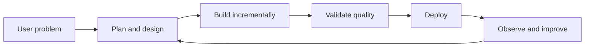

<!--
  PUBLIC GITHUB PROFILE README — CURATED EDITION
  Only current, relevant, free, and publicly verifiable profile components are
  shown. Future/reference topics are intentionally excluded from this file.
  Last reviewed: 2026-07-12 (Asia/Kolkata)
-->

<a id="top"></a>

<div align="center">

<picture>
  <source media="(prefers-color-scheme: dark)" srcset="https://capsule-render.vercel.app/api?type=waving&color=0:7C3AED,50:2563EB,100:06B6D4&height=235&section=header&text=Manashjyoti%20Bora&fontSize=52&fontColor=ffffff&animation=twinkling&fontAlignY=35&desc=Full%20Stack%20Developer%20%E2%80%A2%20Nagaon%2C%20Assam%20%E2%80%A2%20Android%20to%20Cloud&descAlignY=58&descSize=17">
  
</picture>

<a href="https://github.com/Manashjyoti-Bora">
  
</a>

# Hey, I'm Manashjyoti Bora 👋

### Full Stack Developer · React · Next.js · TypeScript · Node.js

**I build responsive, secure, product-focused web applications—from Android to Cloud.**


<p>
  <a href="https://github.com/Manashjyoti-Bora?tab=repositories"></a>
  <a href="https://nexusmart-dusky.vercel.app"></a>
  <a href="https://www.linkedin.com/in/manashjyoti-bora"></a>
  <a href="mailto:manashjyotibora122@gmail.com"></a>
</p>

<p>
  
  
  
  
  
</p>

</div>

> [!NOTE]
> I am currently open to full-time roles, internships, open-source collaboration, and learning-focused opportunities.

---

## 📑 Navigation

- [About](#-about)
- [Featured work](#-featured-work)
- [Verified stack](#%EF%B8%8F-verified-stack)
- [How I build](#-how-i-build)
- [GitHub activity](#-github-activity)
- [Contribution visuals](#-contribution-visuals)
- [Current roadmap](#-current-roadmap)
- [Connect](#-connect)

---

## 👨‍💻 About

```ts
const manashjyoti = {
  role: "Full Stack Developer",
  location: "Nagaon, Assam, India",
  focus: ["React", "Next.js", "TypeScript", "Node.js"],
  strengths: ["responsive UI", "full-stack ownership", "secure defaults"],
  learning: ["advanced TypeScript", "Rust", "Docker", "Kubernetes"],
  availability: ["full-time", "internships", "open source"],
  originStory: "Started coding on Android with Termux",
};
```

I enjoy turning ideas into maintainable web products with thoughtful interfaces, validated data, practical security, and clear documentation.

- 🔭 Building full-stack TypeScript and JavaScript projects.
- 🌱 Improving architecture, testing, accessibility, containers, and cloud-native fundamentals.
- 👯 Open to React/Next.js collaboration, open source, internships, and hackathons.
- 📱 Started coding on an Android phone with Termux before having a laptop.
- 🗓 Active on GitHub since February 2025.

---

## 🚀 Featured Work

### NexusMart — Full-Stack E-commerce

**Next.js · TypeScript · MongoDB Atlas · JWT/Jose · bcrypt · Zod**

A working e-commerce application with account creation, authentication through HTTP-only cookies, product browsing, cart and checkout flows, database persistence, server-side validation, and a role-gated admin experience.

[](https://github.com/Manashjyoti-Bora/nexusmart)
[](https://nexusmart-dusky.vercel.app)

### AUREA — Developer Portfolio Source

**Next.js 14 · TypeScript · Tailwind CSS · Framer Motion · GSAP · Three.js**

A developer-portfolio codebase featuring a 3D hero, command palette, animation systems, and a GitHub-focused dashboard. The source is public; the live deployment link is intentionally omitted until its current runtime error is fixed.

[](https://github.com/Manashjyoti-Bora/portfolio-website)

### DevHire Pro — Job Portal and ATS

**React 19 · Vite · JavaScript · Modern CSS**

An applicant-tracking interface with multi-attribute filtering, light/dark themes, and application pipeline states.

[](https://github.com/Manashjyoti-Bora/devhire-pro-ats)

### TaskFlow Enterprise — Kanban Productivity

**React · Vite · JavaScript · Centralized UI state**

A Kanban-style productivity application with dynamic task movement, priority tagging, and sprint-oriented interaction.

[](https://github.com/Manashjyoti-Bora/taskflow-enterprise)

### Repository cards

<div align="center">
  <a href="https://github.com/Manashjyoti-Bora/nexusmart"></a>
  <a href="https://github.com/Manashjyoti-Bora/portfolio-website"></a>
  <a href="https://github.com/Manashjyoti-Bora/devhire-pro-ats"></a>
  <a href="https://github.com/Manashjyoti-Bora/taskflow-enterprise"></a>
</div>

---

## 🛠️ Verified Stack

<p align="center">
  
</p>

| Area | Publicly demonstrated technologies |
|---|---|
| Languages | JavaScript, TypeScript, HTML, CSS |
| Frontend | React 18/19, Next.js 14, Tailwind CSS, modern CSS |
| Motion and 3D | Framer Motion, GSAP, Three.js, React Three Fiber |
| Backend and data | Node.js ecosystem, Next.js server features, MongoDB, Mongoose |
| Auth and validation | JWT/Jose, bcrypt, HTTP-only cookies, Zod |
| Forms and UI | React Hook Form, Lucide React |
| Tooling | Vite, ESLint, Prettier, PostCSS, npm, Git, GitHub Actions |
| Deployment | Vercel and GitHub-hosted automation |

### Currently learning


---

## 🧭 How I Build

1. Understand the user problem and expected outcome.
2. Design data boundaries, UI states, validation, and permissions.
3. Build small, reviewable modules.
4. Check responsive layout, keyboard use, focus, errors, and performance.
5. Deploy, observe, document, and improve.



### Working principles

- **Accessible:** semantic structure, keyboard support, alt text, contrast, and reduced-motion awareness.
- **Secure:** validated input, server-side authorization, protected credentials, and safe cookies.
- **Maintainable:** typed boundaries, focused modules, consistent naming, linting, and documentation.
- **Measured:** performance and complexity are optimized after evidence, not guesswork.
- **Honest:** shipped work, learning goals, and future ideas are clearly separated.

---

## 📊 GitHub Activity

<div align="center">
  
  
  <br>
  
  <br>
  
  <br>
  <a href="https://github.com/Manashjyoti-Bora?tab=achievements"></a>
</div>

> Dynamic cards are provided by free third-party services and may occasionally be rate-limited. GitHub is the authoritative data source.

---

## 🐍 Contribution Visuals

### Contribution snake

<picture>
  <source media="(prefers-color-scheme: dark)" srcset="https://raw.githubusercontent.com/Manashjyoti-Bora/Manashjyoti-Bora/output/github-contribution-grid-snake-dark.svg">
  
</picture>

<details>
<summary><strong>View 3D contribution city</strong></summary>

<picture>
  <source media="(prefers-color-scheme: dark)" srcset="./profile-3d-contrib/profile-night-rainbow.svg">
  
</picture>

</details>

These assets are refreshed by free scheduled GitHub Actions.

---

## 🗺️ Current Roadmap

- [x] Build and publish full-stack portfolio projects.
- [x] Add responsive profile presentation and verified project links.
- [x] Automate Snake and 3D contribution visuals.
- [ ] Fix the AUREA portfolio deployment runtime error before restoring its live link.
- [ ] Expand automated testing across application repositories.
- [ ] Add project screenshots and concise case studies.
- [ ] Improve accessibility, performance reporting, and security documentation.
- [ ] Contribute to more external open-source projects.

---

## 🤝 Connect

| Channel | Purpose | Link |
|---|---|---|
| GitHub | Projects and collaboration | [@Manashjyoti-Bora](https://github.com/Manashjyoti-Bora) |
| Repositories | Explore public work | [View repositories](https://github.com/Manashjyoti-Bora?tab=repositories) |
| LinkedIn | Professional connection | [Connect](https://www.linkedin.com/in/manashjyoti-bora) |
| Email | Roles, internships, and collaboration | [Send email](mailto:manashjyotibora122@gmail.com) |
| Issues | Profile-repository feedback | [Open an issue](https://github.com/Manashjyoti-Bora/Manashjyoti-Bora/issues) |

> For security-sensitive reports, use email instead of a public issue and remove secrets or personal data from screenshots and logs.

---

<div align="center">

### Thanks for visiting 💜

**Open to work, internships, collaboration, and thoughtful feedback.**

[](https://github.com/Manashjyoti-Bora?tab=repositories)
[](mailto:manashjyotibora122@gmail.com)

[⬆ Back to top](#top)


</div>
